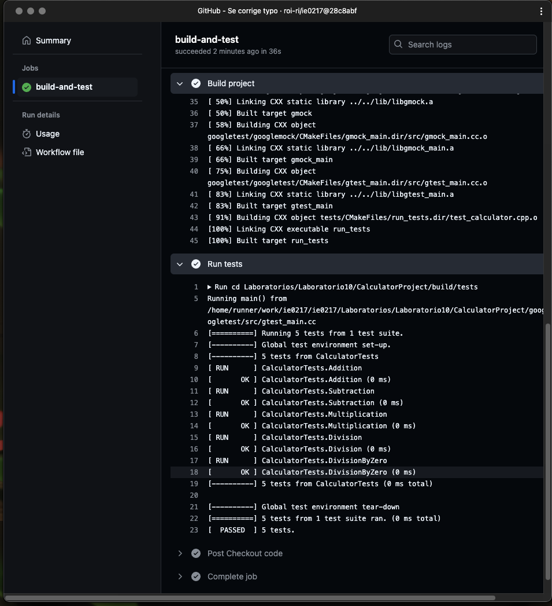
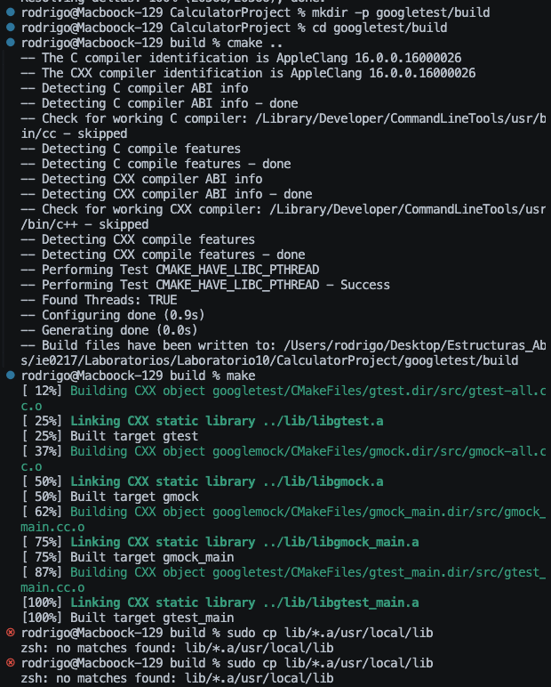
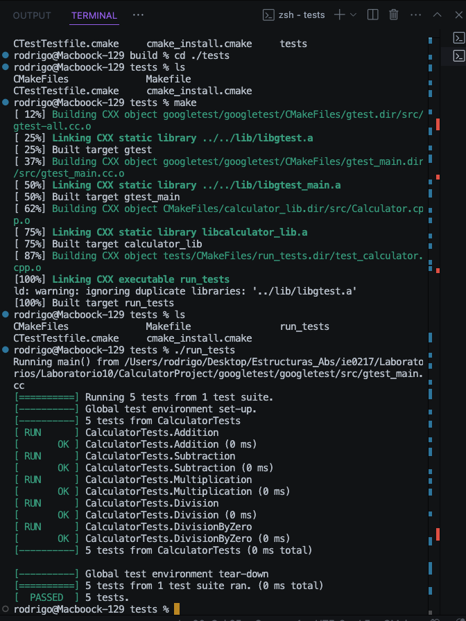

# Laboratorio # 10 Estructuras Abstractas de datos y Algoritmos para Ingeniería IE0217.

## Profesor: Esteban Badilla Alvarado.
## Estudiante: Rodrigo Sánchez Araya, C37259.

### GitHub Actions

Ejecucion del GitHub Actions: 

(Nota para el yo del futuro: Agregar los paths y ser cuidadoso con los typos porque ocurrió mucho eso jejeps)

### Google Test de manera local

Con los comandos que pide el profesor ejecutar, da error el ultimo de ``sudo cp lib/*.a/usr/local/lib``: 

Pero se crea una carpeta ``build`` dentro de ``CalculatorProject`` y se establece la misma secuencia de ``cmake ..`` y ``make`` para poder ver los resultados: 

