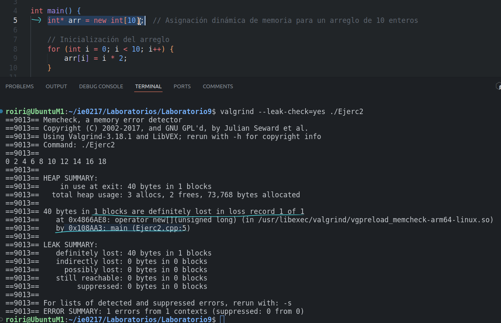

# Laboratorio # 9 Estructuras Abstractas de datos y Algoritmos para Ingeniería IE0217.

## Profesor: Esteban Badilla Alvarado.
## Estudiante: Rodrigo Sánchez Araya, C37259.

**1. Corrección ejercicio 1.**

Para el ejercicio 1 se comienza agregando breakpoints en las lineas 5 y se empieza a ejecutar el codigo con el comando next para poder pasar a la linea del for. Dentro de esta se observa que, el indice i empieza en 0 y se espera que llegue a tener valor igual al ``numeros.size()`` para que termine el for, esto estaría fuera del rango del arreglo, deberia ser hasta 5 es decir, ``< numeros.size()`` , por eso se cambia el for de la siguiente manera: ``for (int i = 0; i < numeros.size(); i++)``.

Se ocupa que el programa devuelva numeros tipo double, pero por ejemplo, en la primera funcion se tiene que, ``suma`` es un entero y ``numeros.size()`` tambien, por consiguiente el elemento que devuelve la funcion es tipo entero, y no hace nada declarandolo por fuera como un double. 
Igual para la funcion de mediana, se tiene que dividir entre un 2.0 para que el numero sea tipo double. 

**2. Ejercicio 2**

Para este ejercicio se tiene que, se inicializa un puntero tipo entero a un arreglo, donde se crea con el comando ``new`` pero nunca se libera esta memoria.
Lo subrayado en celeste dentro de la imagen muesta el mensaje del error donde se pierden 40 bytes. 

Solucion: 

Se agrega la linea de ``delete[] arr;`` para poder liberar la memoria asignada al arreglo. Se puede observar en la imagen de abajo que ya no se muestra dicho error. 

**3. Ejercicio 3**

Para este ejercicio se tiene dentro del código un elemento que no "existe", está fueras de los límites del arreglo (``arr[10]``).

En la captura se obserba que el mensage obtenido de valgrind es que hay un espacio de memoria inaccesible en la linea 12, que corresponde a donde se está llamando a ``arr[10]``.

La solución a esto es simplemente poner algún elemento que esté dentro del alcance del arreglo: 

**4. Ejercicio 4 y 5**

Para el ejercicio 4 lo que ocurre es que, a la hora de ejecutar el programa hay una especie de "pelea" entre el thread 1 y thread 2 ya que no tienen ninguna limitante a la hora de acceder a lo que es la funcion del contador por lo que cada una altera su valor sin esperar a la anterior: 

Se muestra que hay conflicto con elementos previamente escritos. 

La solucion es agregar mutex a este contexto para así permitir que, un hilo pueda ingresar al for y luego el otro hilo, para que así no se sobreescriban los valores y no se genere ningún conflicto. 

Para la ejecución solicitada en el ejercicio 5 no presenta ningun error (No estoy seguro si debía mostrar alguno o no). 

