# Dentro de esta sección se presenta el apartado para la sesión # 10 del curso IE0217.

## Interfaces Gráficas en C++ con FLTK y WxWidgets

### Introducción a las Interfaces Gráficas (GUI)
- **Definición**: Las interfaces gráficas (GUI) permiten a los usuarios interactuar con programas a través de elementos visuales como botones, menús y ventanas.
- **Interfaz de Usuario (UI)**: Se refiere al diseño visual y funcional de los elementos de interacción.
- **Experiencia de Usuario (UX)**: Se enfoca en cómo los usuarios perciben e interactúan con un producto, considerando tanto aspectos prácticos como emocionales.

## WxWidgets
- **Descripción**: Una biblioteca de C++ para crear aplicaciones multiplataforma con una única base de código. Soporta Windows, macOS, Linux y más.
- **Características**:
  - Apariencia nativa en cada plataforma.
  - Extenso conjunto de widgets y amplia documentación.
  - Licencia múltiple (compatible con GPL).
  - Comunidad grande y activa.
  - Integración con C++ y otros lenguajes como Python.
  - Conjunto variado de estilos visuales predefinidos.

## FLTK
- **Descripción**: Un kit de herramientas GUI ligero y multiplataforma. Soporta Windows, macOS y Linux, con soporte para gráficos 3D mediante OpenGL.
- **Características**:
  - Biblioteca pequeña y modular.
  - Conjunto limitado de widgets.
  - Integración sencilla con C++.
  - Menor comunidad y documentación menos extensa en comparación con WxWidgets.
  - Estilos predeterminados simples.

## Comparativa WxWidgets vs FLTK
- **WxWidgets**:
  - Soporte para más plataformas.
  - Conjunto de widgets más amplio.
  - Documentación más extensa.
  - Licencia GPL compatible.
- **FLTK**:
  - Biblioteca más ligera y simple.
  - Menos widgets y documentación, pero más fácil de integrar y utilizar en proyectos pequeños.

- Ejecucion de WxWidgets:

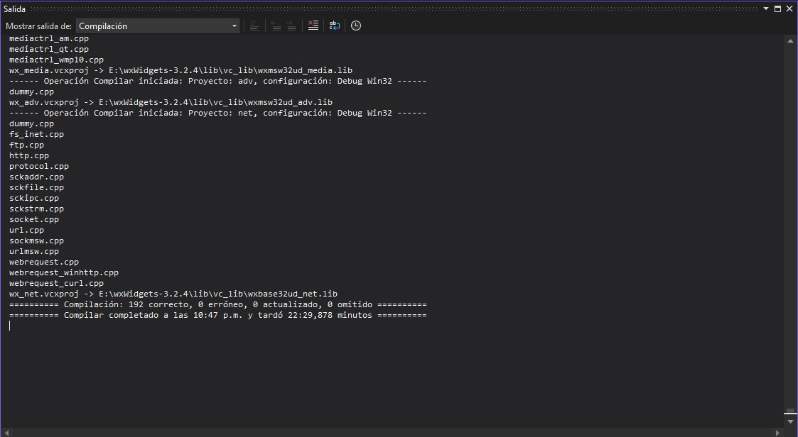

- Hellow World en VS:

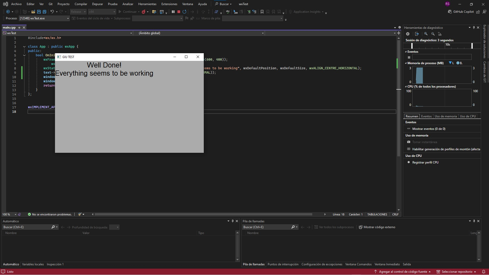

- Ventana Basica en VS:

- Controles: 

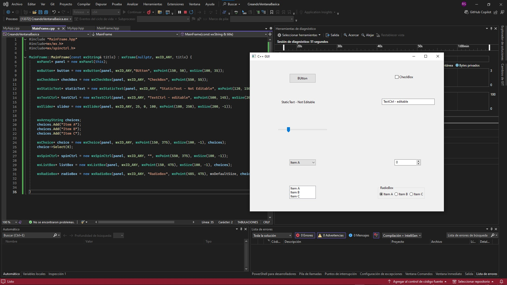

- Estilo: 

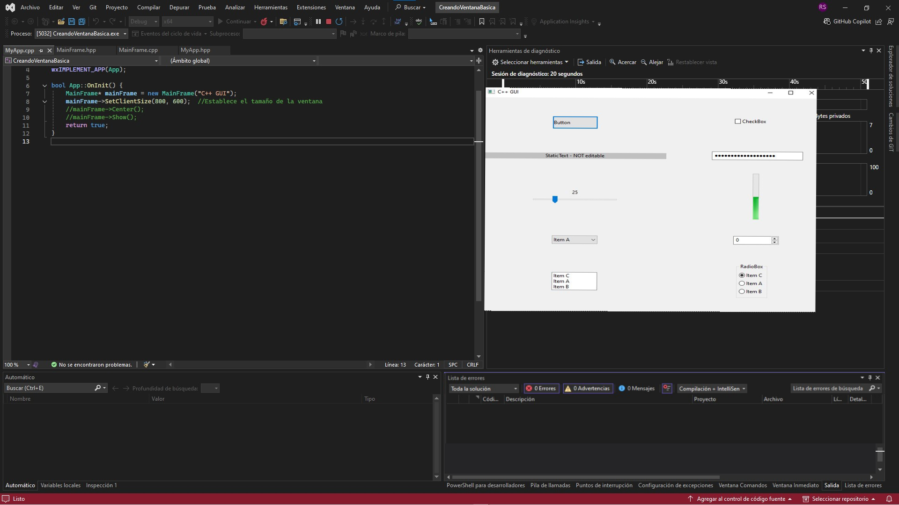

## Eventos en WxWidgets
- **Eventos Estáticos y Dinámicos**: 
  - Manejo estático: los eventos están predefinidos y asignados de manera rígida.
  - Manejo dinámico (Binding): permite una mayor flexibilidad, asociando eventos a controladores de manera programática.

- Eventos en la pantalla Manejo Estatico: 

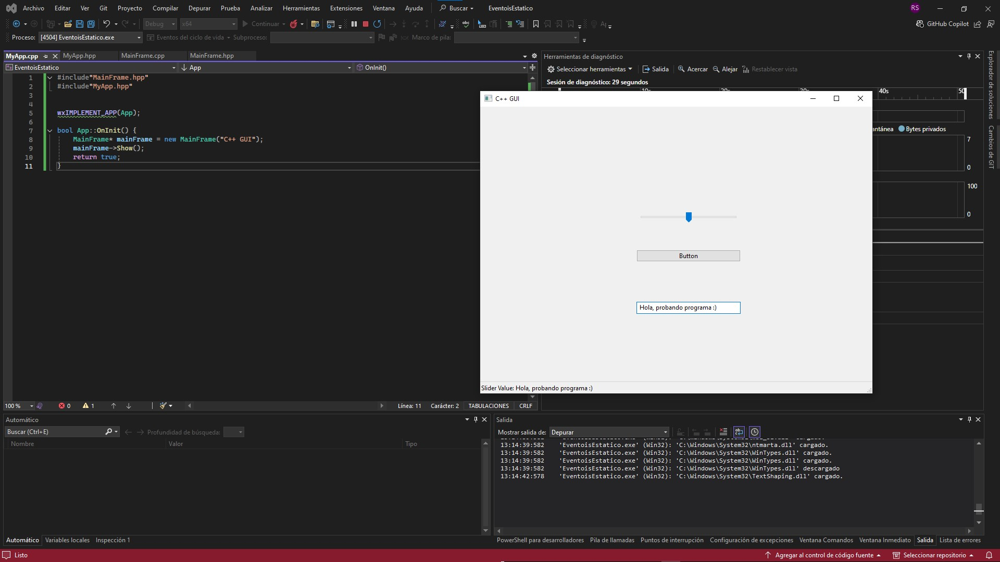

- Eventos en la pantalla Manejo Dinamico:

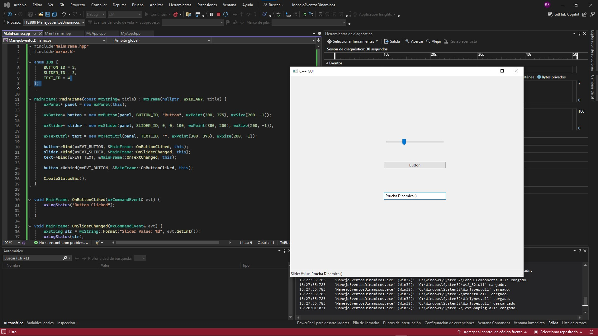

  
## Eventos del Mouse y Teclado
- **Eventos del Mouse**: 
  - Detección del movimiento y clics del ratón mediante eventos específicos como `wxEVT_MOTION`.

- Posición del mouse: 

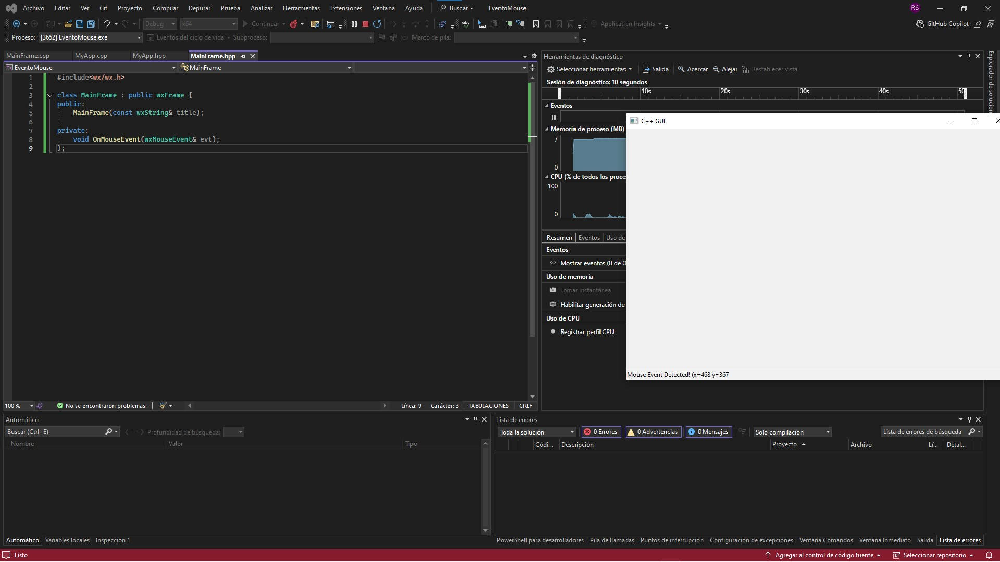

- **Eventos del Teclado**: 
  - Captura de eventos de teclas dependiendo de dónde esté enfocada la interfaz en cada momento.

- Presiona cualquier tecla del teclado: 

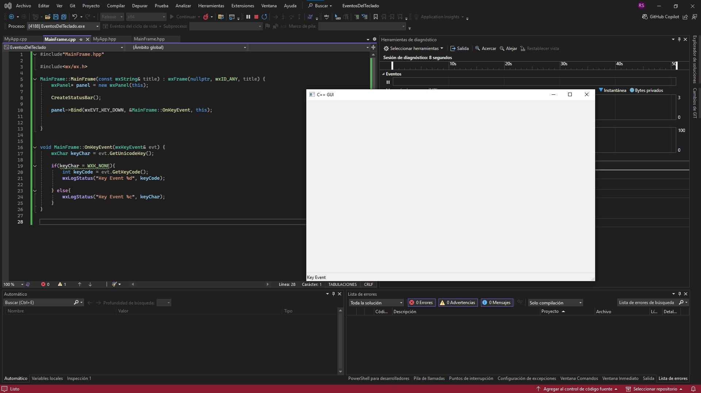

- Presion en lugar especifico con el teclado: 

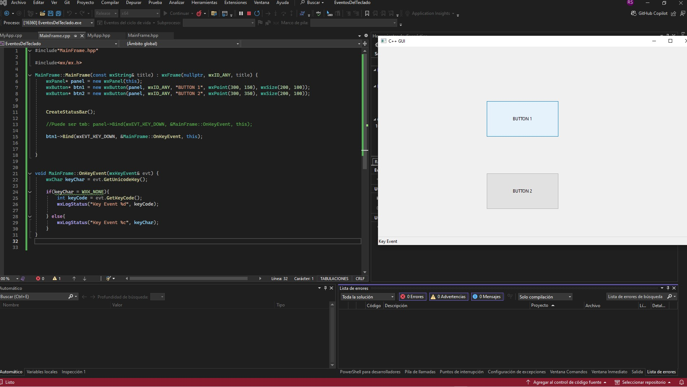

## Propagación de Eventos
- **Descripción**: Los eventos pueden propagarse a través de una jerarquía de elementos, permitiendo que varios componentes respondan a la misma acción.

- Click en un boton: 

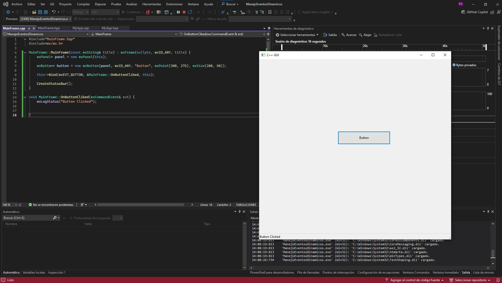

- Dos botones:

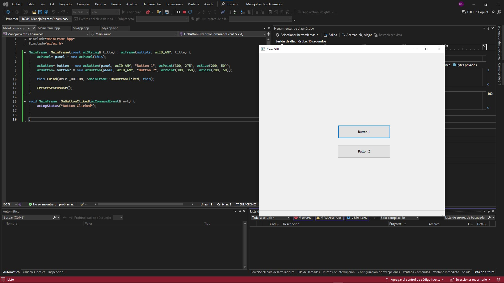

- Dice que boton se tocó:

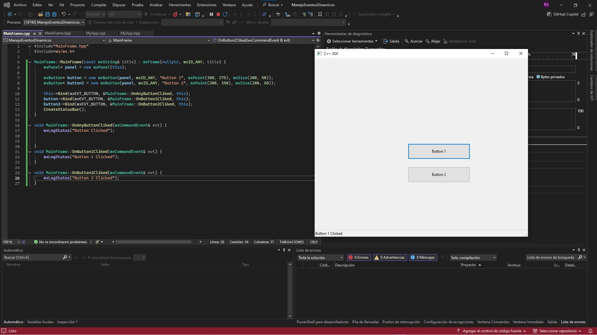

