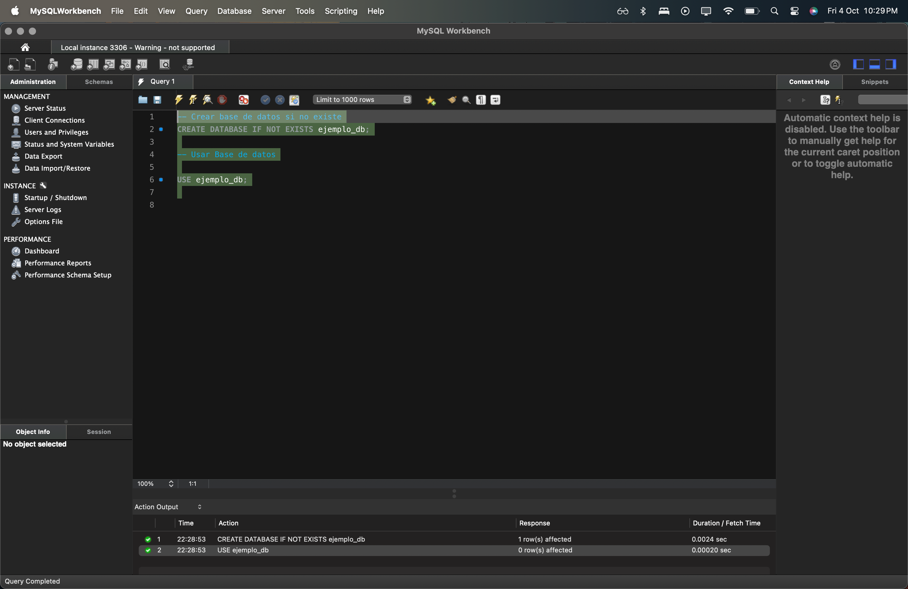
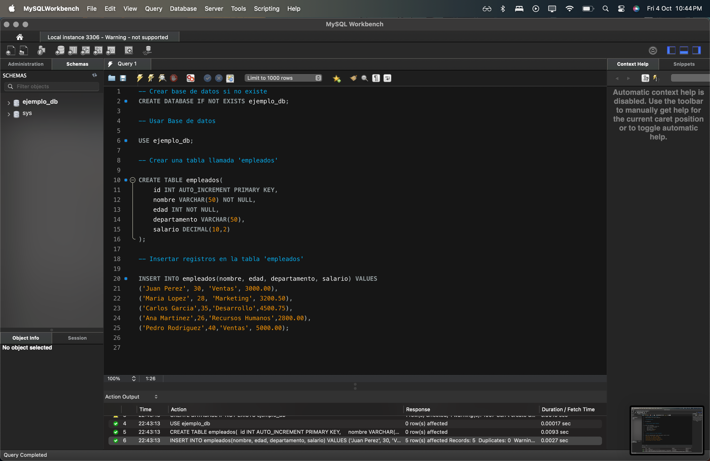
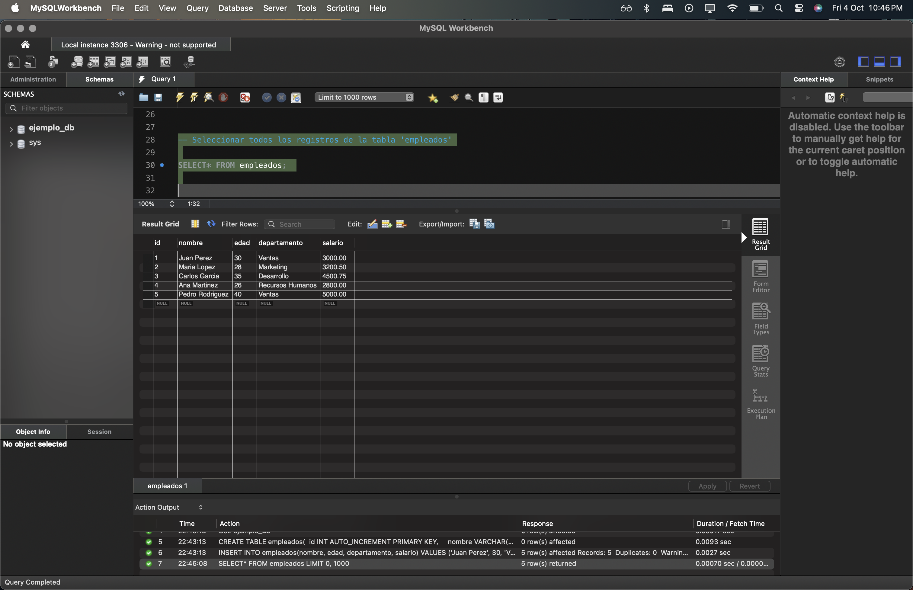
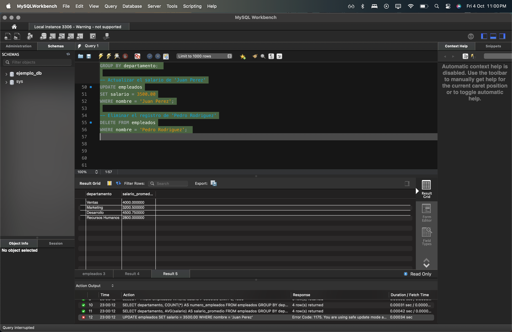
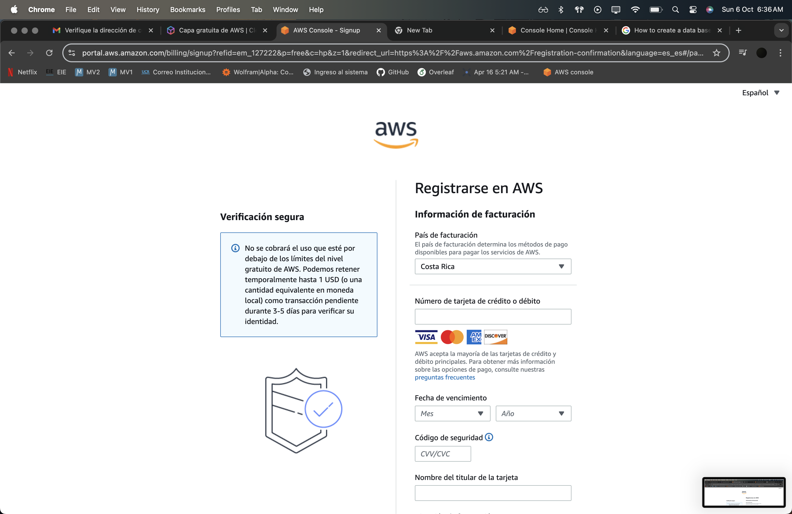
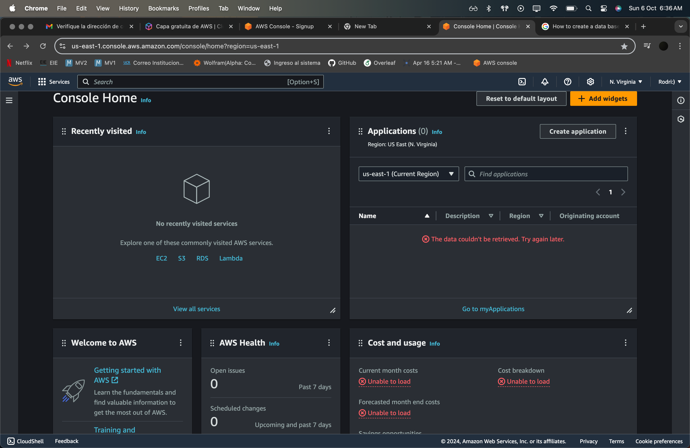

# Dentro de esta sección se presenta el apartado para la sesión # 9 del curso IE0217.


### Instrucciones para la ejecución de los programas

1. Navegue hasta el directorio donde se encuentra la sesión5  utilizando el comando `cd`

```bash
# en este caso puede que la ruta dea la siguiente:
cd /ie0217/Sesiones/Sesion12
```

2. Para el archivo de expreciones regulares ejecute el siguiente comando: 

```cpp
g++ -o main -IC:\sqlite -LC:\swlite -lsqlite3 SQLite.cpp

```

## Resumen de la sesion 12

### Servidor de base de datos: 

Es un sistema de software uqe proporciona servicios de almacenamiento, gestión y recuperación de datos a otros programas o dispositivos en la red. 


- Características y funciones de un servidor de bases de datos
    - Almacenamiento centralizado: Almacena todos los datos de manera centralizada. Permite una gestión más eficiente y segura de la información.

    - Procesamiento de cosultas
        - El servidor recibe consultas SQL de los clientes, las procesa y devuelve los resultados.

    - Gestión de concurrencia
        - Maneja múltiples conexciones simltáneas de varios clientes, garantizando que las operaciones se realicen de manera consistente y sin conflictos.
    - Seguridad
        - Proporciona mecanismos para controlar el acceso a los datos, como autenticación de usuarios, permisos y encriptación.
    
    - Alta disponibilidad
        - Implementa características como replicación y clustering para asegurar que los datos estén disponibles incluso en caso de fallos del sistema.
    - Ejemplos de servidores de bases de datos
        - MySQL Server
        - PostgreSQL Server
        - Microsoft SQLServer
        - Oracle Database Server

### Cliente de base de datos:

Es una aplicación o dispositivo que se conecta as un servidor de bases de datos para enviar consultas y recibir resultados. Puedes ser interfaces gráficas (GUI), aplicaciones de línea de comandos o aplicaciones desarrolladas por usuarios finales que necesitan interactiar con la base de datos.

- Características y funciones de un cliente de base de datos
    - Conexión al servidor: El cliente se conecta al servidor de bases de datos a través de una red, utilizando protocolos específicos como TCP/IP.

    - Envío de consultas: Los clientes envían consultas SQL al servidor de bases de datos. Estas consultas pueden ser operaciones de lectura (SELECT) o de escritura (INSERT, UPDATE, DELETE).

    - Recepción de resultados: Después de que el servidor procesa una consula, el cliente recibe los resultados para su presentación o procesamiento adicional.

    - Interfaz de usuario: Muchos clientes proporcionan una interfaz gráfica o de línea de comandos para facilitar la interacción del usuario con la base de datos

    - Ejemplo de cliente en bases de datos: 
        - MySQL Workbench: interfaz gráfica para MySQL
        - hpMyAdmin: Herramienta web para administrar MySQL
        -  pgAdmin: Interfaz gráfica para PostgreSQL
        - SQL Server Management Studio (SSMS): Herramienta gráfica para Microsoft SQL Server
        - SQL*Plus y Oracle SQL Developer: Herramientas para interactuar con Oracle Database.

### Motores de bases de datos

Un motor de base de datos relacional (RDBMS, por sus siglas en inglés) es un sistema de software que permite crear, gestionar y consultar bases de datos organizadas en tablas que están relacionadas entre sí mediante claves  primarias y foráneas.

- MySQL

    - fue creado por MySQL AB en 1995 y es actualmente propiedad de Oracle Corporation desde 2010. Es uno de los sistemas de gestión de bases de datos más populares y utilizados en el mundo

    - Casos de uso:
        - Aplicaciones web: Utilizado en sitios web de alto tráfico como Facebook, Twitter y YouTube.
        - E-commerce: Tiendas en línea como Magento y Shopify.
        - Aplicaciones empresariales: Usado en sistemas de gestión de contenido (CMS) como WordPress y Joomla.

- PostgresSQl

    - fue desarrollado originalmente en 1986 en el Departamento de Ciencias de la Computación de la Universidad de California en Berkeley. Es un proyecto de código abierto mantenido por una comunidad global de desarrolladores.
    - Permite definir sus propios tipos de datos, funciones y operadores. Altamente conforme con los estándares SQL, lo que asegura portabilidad y coherencia.
    - Garantiza Atomicidad, Consistencia, Aislamiento y Durabilidad de las transacciones. (ACID: Atomicity, Consistency, Isolation and Durability).
    - Soporta replicación lógica y física, así como recuperación ante fallos. Soporte nativo para almacenar y consultar datos en formato JSON y XML.
    - Casos de uso:
        - Aplicaciones financieras: Utilizado por empresas como ACI Worldwide y Bloomberg para manejar transacciones críticas.
        - Geoespaciales: Usado en aplicaciones GIS (Sistemas de Información Geográfica) debido a su soporte para PostGIS.
        - Analítica y BI: Herramientas de análisis de datos y business intelligence debido a su capacidad para manejar grandes volúmenes de datos y consultas complejas.

- Microsoft SQL Server 

    - Desarrollado por Microsoft, SQL Server fue lanzado por primera vez en 1989. Es un sistema de gestión de bases de datos relacionales diseñado para la plataforma Windows, aunque también soporta Linux.
    - Se integra perfectamente con otros productos de Microsoft, como Azure, Windows Server, y herramientas de desarrollo como Visual Studio.
    - Utiliza Transact-SQL (T-SQL) como su lenguaje de consulta, que extiende SQL con características adicionales como control de flujo, manejo de errores, y procedimientos almacenados.

    - Casos de uso:
        - Empresas: Utilizado por grandes corporaciones y empresas para aplicaciones críticas.
        - E-commerce: Plataformas de comercio electrónico que requieren alta disponibilidad y escalabilidad.
        - BI y Analítica: Herramientas de análisis y reporting en tiempo real.

- Oravle Database
    - Desarrollado por Oracle Corporation, Oracle Database fue lanzado por primera vez en 1979. Es uno de los sistemas de gestión de bases de datos más antiguos y avanzados, ampliamente utilizado en grandes empresas.
    - Diseñado para manejar grandes volúmenes de datos y alta carga de trabajo. Soporta escalabilidad horizontal y vertical.
    - Proporciona mecanismos avanzados de seguridad, incluyendo cifrado de datos, auditoría, y control de acceso granular.
    - Ofrece soluciones robustas de alta disponibilidad como Oracle Real Application Clusters (RAC) y Data Guard. Compatible con varias plataformas, incluyendo Windows, Linux, y Unix.

    - Casos de uso:
        - Banca y finanzas: Utilizado por bancos y compañías financieras para gestionar transacciones y datos críticos.
        - Telecomunicaciones: Implementado por compañías de telecomunicaciones para gestionar grandes volúmenes de datos de clientes y servicios.
        - Gobierno: Utilizado en sistemas gubernamentales para la gestión de datos sensibles y de alta seguridad

- SQLite

    - SQLite fue creado por D. Richard Hipp en el año 2000. Es un proyecto de dominio público y se utiliza ampliamente debido a su simplicidad y eficiencia.
    - SQLite es una biblioteca de C que implementa un motor de base de datos SQL embebido, sin necesidad de un servidor separado. Compatible con muchas plataformas, incluyendo dispositivos móviles, sistemas embebidos, y aplicaciones de escritorio.
    - No requiere instalación ni configuración, lo que facilita su integración en aplicaciones. A pesar de ser ligero, es altamente confiable y utilizado en muchas aplicaciones críticas.
    - Soporta bases de datos de hasta 140 terabytes, adecuado para una amplia gama de aplicaciones. Código abierto y gratuito para usar sin restricciones.

    - Casos de uso:
        - Aplicaciones móviles: Utilizado en aplicaciones móviles como almacenamiento de datos local (por ejemplo, Android y iOS).
        - Navegadores web: Empleado en navegadores web para almacenar datos localmente (por ejemplo, Firefox y Chrome).
        - Aplicaciones de escritorio: Usado en software de escritorio para gestionar datos de configuración y usuario.
        - Dispositivos embebidos: Implementado en sistemas embebidos debido a su baja huella de memoria y simplicidad.

### Pruebas de ejecución de lso códigos: 










- Para la parte de SQL en Visual estudio se pueden seguir los pasos del iniicio del README para ejecutar los debidos elementos.

- En caso del AWS se imposibilitó acceder al recurso, cada vez que intentaba crear una cuenta no había opción de saltar la opción de ingresar una tarjeta de crédito/debito.



En la página que creo es la principal de AWS no había opción para crear un database



