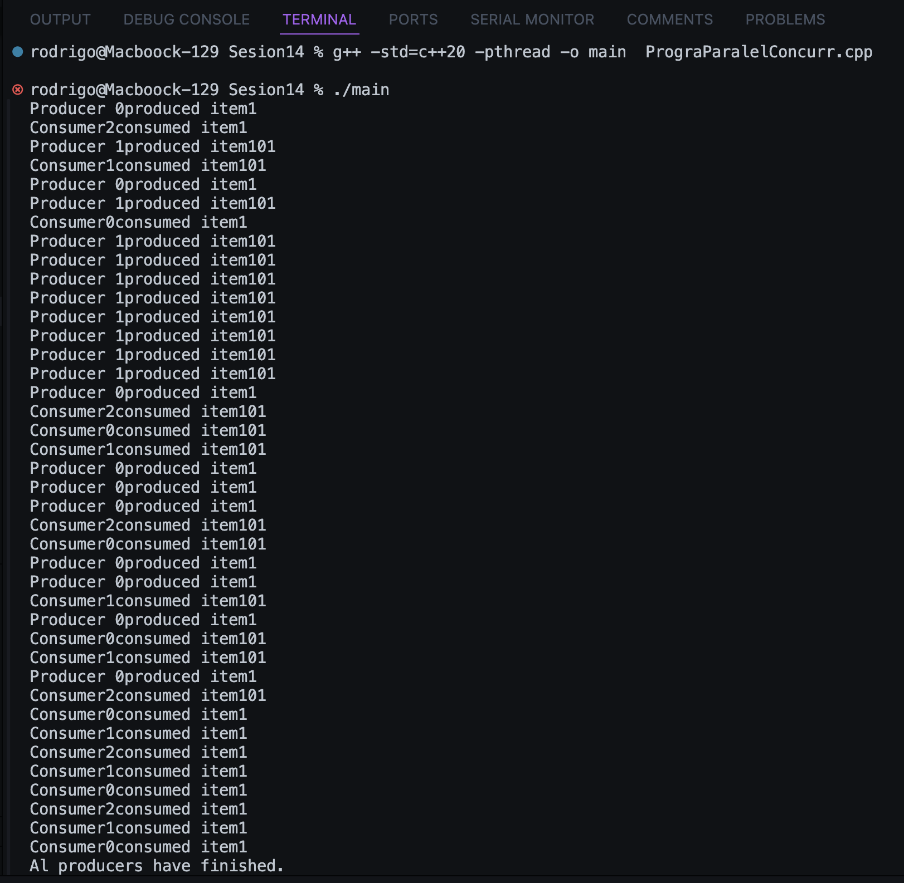

# Dentro de esta sección se presenta el apartado para la sesión # 14 del curso IE0217.


### Instrucciones para la ejecución de los programas

1. 

```bash
# en este caso puede que la ruta dea la siguiente:
cd /ie0217/Sesiones/Sesion14
```

2. 

```cpp


```


# Resumen de la sesion: Programación Paralela y Concurrente

## Procesos e Hilos
- **Proceso**: Instancia de un programa en ejecución con su propio espacio de memoria.
  - **Independencia**: Los procesos no afectan directamente a otros.
  - **Costos**: Crear y gestionar procesos es costoso.
  - **Comunicación**: Se requieren mecanismos como pipes o sockets para comunicarse entre procesos.
- **Hilo**: Unidad de ejecución dentro de un proceso que comparte el espacio de memoria.
  - **Dependencia**: Los hilos dentro de un proceso pueden afectar el estado del otro.
  - **Costos**: Menos costoso que los procesos.
  - **Comunicación**: Los hilos pueden comunicarse a través de memoria compartida.

## Multitarea
- **Multitarea**: Capacidad de un sistema operativo para ejecutar múltiples tareas (procesos) de manera concurrente.
  - Cada tarea recibe un pequeño intervalo de tiempo.
  - El sistema alterna entre tareas rápidamente.
  - Mejora la utilización de la CPU y la capacidad de respuesta.

## Paralelismo vs Concurrencia
- **Paralelismo**: Ejecución simultánea de múltiples tareas en sistemas con múltiples núcleos de CPU.
  - Requiere hardware con capacidad para múltiples tareas simultáneas.
- **Concurrencia**: Múltiples tareas progresan al mismo tiempo, pero no necesariamente se ejecutan al mismo tiempo.
  - El sistema gestiona las tareas para que no interfieran entre sí.

## Procesadores Multinúcleo y Multiprocesador
- **Multinúcleo**: Un chip de CPU con múltiples núcleos de procesamiento.
  - Cada núcleo puede ejecutar instrucciones de manera independiente.
- **Multiprocesador**: Un sistema con múltiples chips de CPU, cada uno con uno o más núcleos.

## Memoria Compartida vs Memoria Distribuida
- **Memoria compartida**: Múltiples núcleos o procesadores comparten el mismo espacio de memoria física.
- **Memoria distribuida**: Cada procesador o nodo tiene su propia memoria local, la comunicación entre nodos se realiza a través de una red.

## Modelos de Programación
- **Modelo de memoria compartida**: Múltiples hilos o procesos comparten un espacio de memoria común.


- **Modelo de paso de mensajes**: Los procesos se comunican mediante el envío y recepción de mensajes.

## Condiciones de Carrera
- **Condición de carrera**: Ocurre cuando dos o más hilos acceden a una memoria compartida al mismo tiempo y al menos uno realiza una operación de escritura.

## Sincronización de Hilos
- **Sincronización**: Controla el acceso concurrente a recursos compartidos para evitar condiciones de carrera.
  - **Mutex**: Bloqueo que permite que solo un hilo acceda a una sección crítica.
  - **Semáforos**: Controlan el acceso a recursos compartidos por múltiples hilos.

## Bloqueos y Deadlocks
- **Bloqueo**: Situación donde un hilo adquiere un recurso y bloquea a otros hilos.
- **Deadlock**: Dos o más hilos se bloquean mutuamente, esperando recursos que nunca serán liberados.

## Costos Asociados a la Creación y Administración de Hilos
- **Creación de hilos**: Requiere tiempo y memoria para inicializar un hilo.
- **Context switching**: Cambio de contexto entre hilos, lo que implica sobrecarga adicional.
- **Sincronización**: El acceso concurrente a recursos compartidos necesita gestión cuidadosa para evitar contención.

## Consideraciones de Rendimiento
- **Número de hilos**: Ajustar el número de hilos al número de núcleos para optimizar la carga.
- **Granularidad de las tareas**: Balancear el tamaño de las tareas para minimizar el overhead.

## Ejemplo: Productores y Consumidores
- **Productores** generan tareas, **consumidores** las procesan usando un búfer compartido y mecanismos de sincronización.

