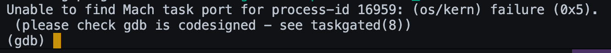

# Dentro de esta sección se presenta el apartado para la sesión # 15 del curso IE0217.


### Instrucciones para la ejecución de los programas

1. Ubicación de los archivos.

```bash
# en este caso puede que la ruta dea la siguiente:
cd /ie0217/Sesiones/Sesion15
```

2. Para ejecutar ejercicio con gdb:

```bash
    # Para el ejercicio inicial de gdb
    g++ -g -o main  Prueba1.cpp
    gdb Prueba1.cpp
    # Ingresar comandos a realizar con gdb
```

3. Para ejecutar ejercicio con Valgrind:
```bash
g++ -g -o programa PruebaValgrind.cpp
valgrind --leak-check=yes ./programa
```

4. Para ejecutar ejercicio con Sanitizer: 
```bash
g++ -fsanitize=address -g -o programa PruebaAsan.cpp
./programa
```

5. Para ejecutar prueba TSan: 
```bash
g++ -fsanitize=thread -g -o programa PruebaAsan.cpp
./programa

```
# Resumen de Depuración: `gdb`, `valgrind`, y Sanitizers

## 1. Depuración
La **depuración** es el proceso de identificar y corregir errores en un programa. Es una etapa crucial para garantizar que el código funcione correctamente y cumpla con los requisitos. La depuración ayuda en:

- **Garantía de calidad**: Asegura que el software funcione según lo previsto.
- **Mantenimiento**: Permite mantener un código más limpio y fácil de actualizar.
- **Eficiencia**: La detección temprana de errores reduce el tiempo necesario para resolverlos.
- **Experiencia del usuario**: Minimiza los fallos y mejora la calidad del producto final.

### Tipos de Errores
1. **Errores de Sintaxis**: Son errores de escritura que el compilador detecta antes de la ejecución.
2. **Errores de Tiempo de Ejecución**: Ocurren durante la ejecución, como división por cero o acceso fuera de los límites de un array.
3. **Errores Lógicos**: Son fallos en la lógica del programa que producen resultados incorrectos sin que se genere un fallo evidente.

## 2. `gdb` (GNU Debugger)
`gdb` es una herramienta de depuración para C, C++ y otros lenguajes. Permite ver el estado de un programa en ejecución o en el momento de un fallo. Algunas características clave:

- **Control de Ejecución**: Pausar y reanudar el programa.
- **Inspección de Variables**: Ver y modificar valores de variables en tiempo real.
- **Breakpoints**: Establecer puntos de interrupción en líneas específicas para pausar la ejecución.
- **Tracing**: Seguir el flujo de ejecución paso a paso.

**Comandos Básicos**:
- `run`: Inicia la ejecución.
- `break`: Establece un punto de interrupción.
- `next`: Ejecuta la siguiente línea sin entrar en funciones.
- `step`: Entra en funciones en la línea actual.
- `continue`: Reanuda la ejecución hasta el próximo `breakpoint`.
- `print`: Muestra el valor de una variable.
- `backtrace`: Muestra la pila de llamadas.


Se tuvo que correr gdb en Ubuntu en (VM) porque al utilizar mac presentaba constantemente el siguiente problema:


Al ejecutar en UBUNTU:




## 3. Valgrind
Valgrind es un conjunto de herramientas para el análisis de programas, especialmente útil en la detección de errores relacionados con la memoria:

- **Memcheck**: Detecta errores de memoria, como accesos fuera de límites o memoria no inicializada.
- **Análisis de Concurrencia**: Herramientas que detectan problemas en programas multihilo, como condiciones de carrera.

**Comando de Ejemplo**:
```bash
g++ -g -o programa programa.cpp
valgrind --leak-check=yes ./programa
```

Valgrind 1 


Continuacion:


### - Sanitizer

Los sanitizers son herramientas adicionales para detectar errores específicos: 

- AdressSanitizer (ASan): Detexta acceso fuera de límites, uso de memoria después de liberarla y memoria no inicializada. 


- ThreadSanitizer (TSan): Detecta condiciones de carrera en programas multihilo.


- Helgrind (de valgrind): Analiza concurrencia para detectar bloqueos y condiciones de carrera.


Continuacion de la imagen anterior: 


