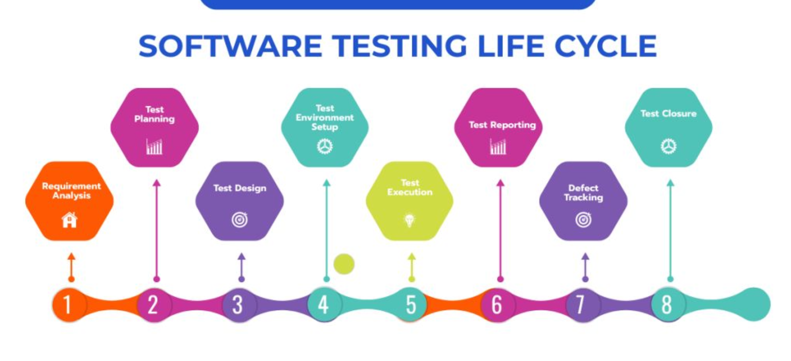
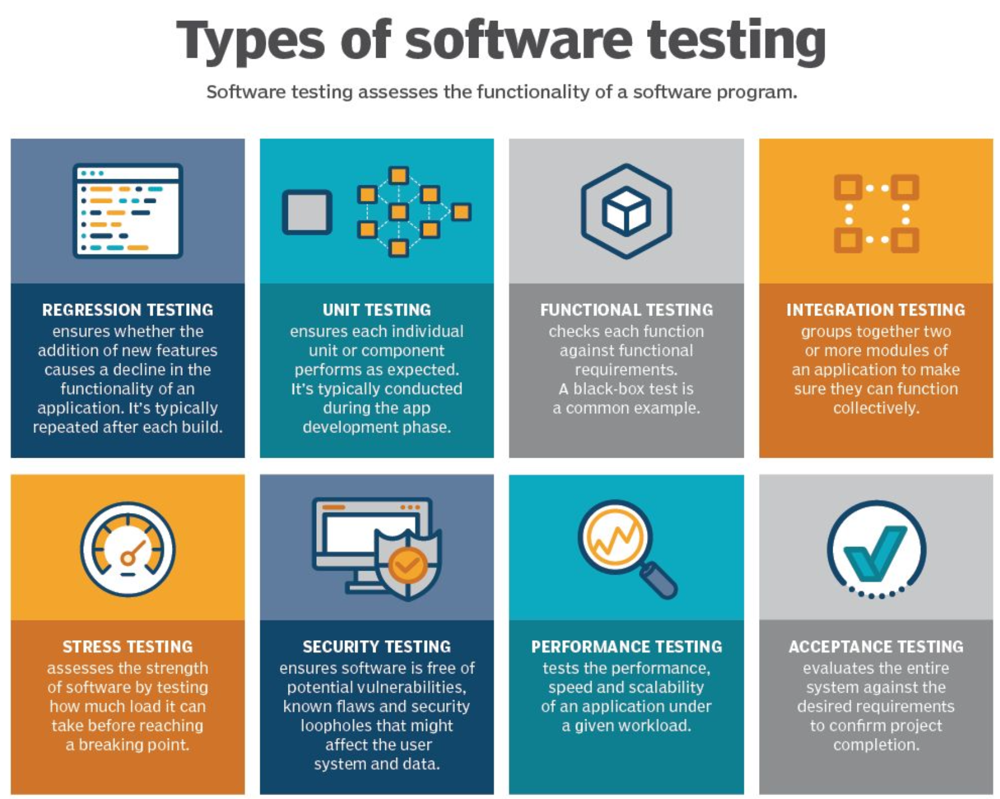
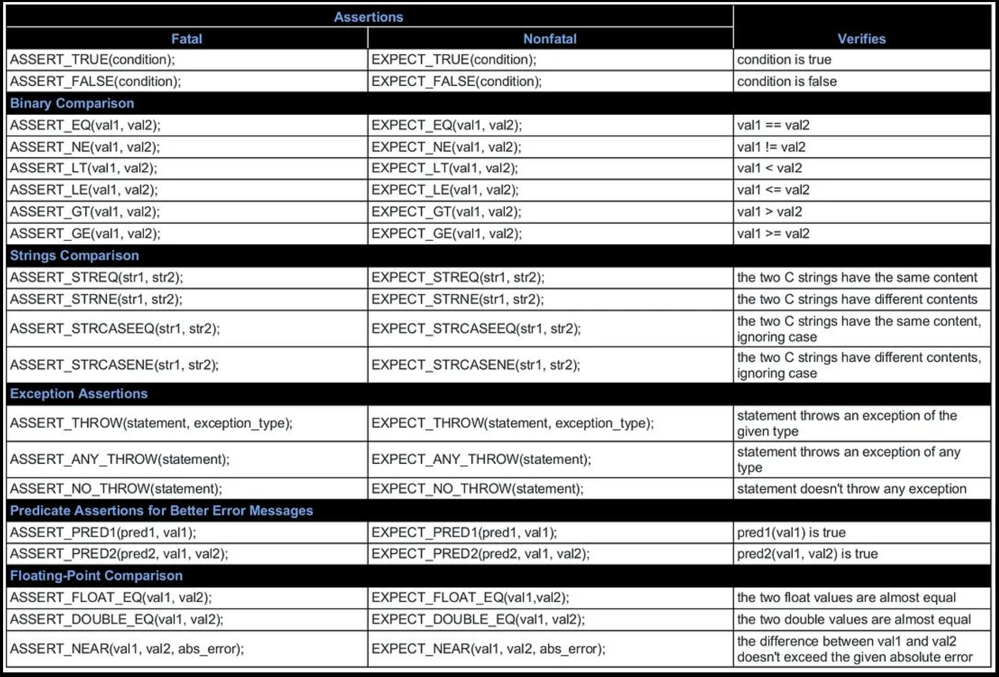
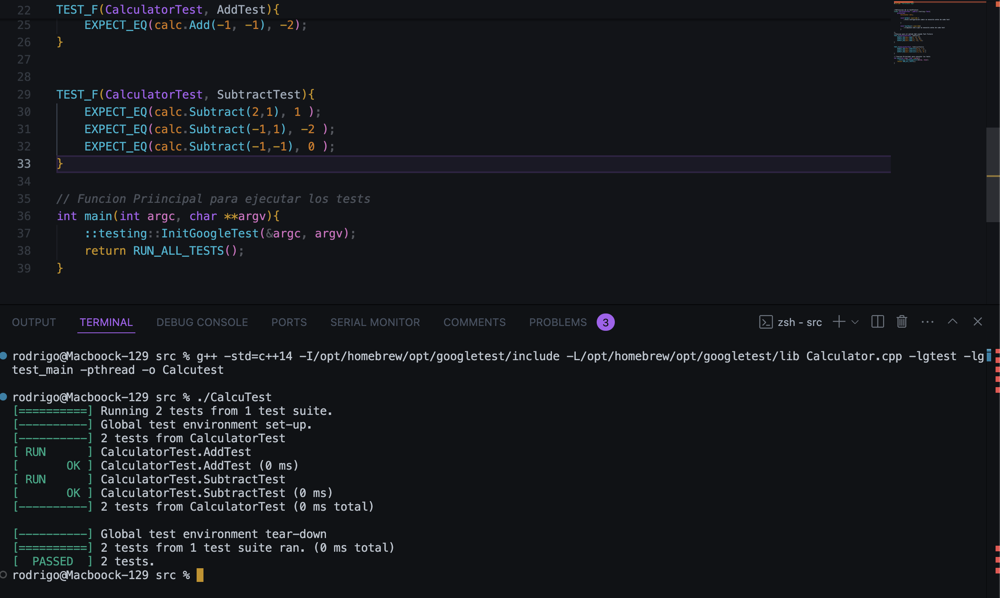
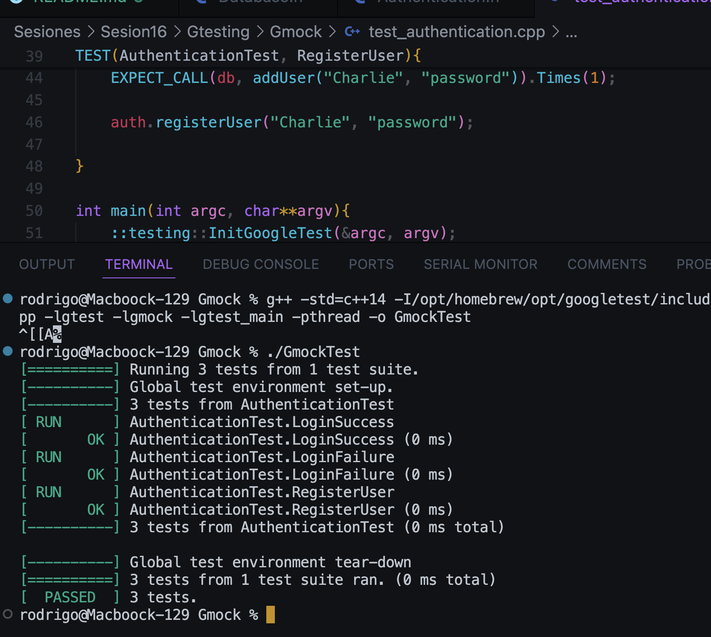
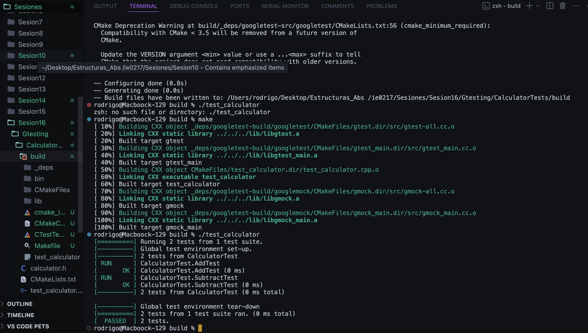
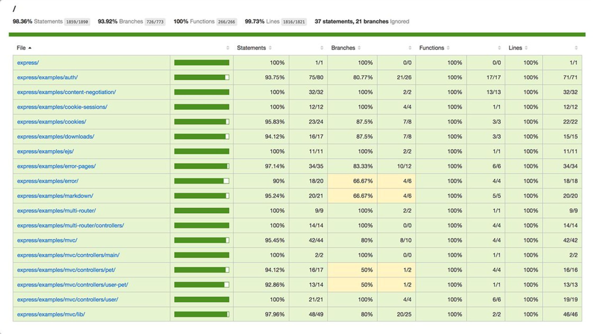
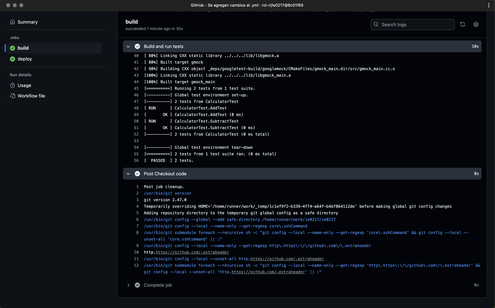

# Dentro de esta sección se presenta el apartado para la sesión # 16 del curso IE0217.


### Instrucciones para la ejecución de los programas

1. Ubicación de los archivos.

```bash
# en este caso puede que la ruta dea la siguiente:
cd ./ie0217/Sesiones/Sesion16
```

2. Para ejecutar el test para la calculadora:

```bash
# Dirigirse a la ubicación del archivo 
cd ./Gtesting/CalculatorTests
mkdir build 
cd build
cmake ..
make 
./test_calculator
```

3. Para ejecutar los elementos de Gmock:

```bash
# Dirigirse a la ubicación del archivo 
cd ./Gtesting/Gmock
g++ -std=c++14 -I/opt/homebrew/opt/googletest/include -L/opt/homebrew/opt/googletest/lib test_authentication.cpp -lgtest -lgmock -lgtest_main -pthread -o GmockTest
```

4. Para probar y ejecutar el generador de Random:

```bash
# Dirigirse a la ubicación del archivo 
cd ./RandomSeed
g++ -o RandomSeed RandomSeed.cpp
```

## Resumen de la Sesión 16 (Software Testing)

#####  Hace referencia al proceso de evaluar y verificar que un software o aplicación cumple con los requisitos especificados y funciona como se espera.

**Objetivos:**

- **Verificación y Validación:** El software hace lo que se supone que se debe hacer (validación) y cumple con los requisitos y especificaciones (verificación).
- **Calidad:** Mejorar calidad del software al identiicar y corregir errores.
- **Confiabilidad y estabilidad:** Garantiza que el software es confiable y estable en diferentes condiciones y escenarios de uso. 

##### Uso de Semillas en el software Testing 


La "semilla" es el vaor inicial utilizado en algoritmos generadores de números aleatorios, asegura que las secuencias de números generados sean reproducibles.

**Características:**

-  **Reproductibilidad:** Permite generar la misma secuencia de números aleatorios en cada ejecución, garantizando condiciones de prueba constantes.
- **Control del entorno:** Facilita el control preciso del entorno de prueba,  escencial para detectar y corregir errores de manera eficiente. 
- **Facilita el debugging:** Permite recrear exactamente el estado en que se produjo un error, mejorando la eficiencia en la resolución de problemas.
- **Documentación:** Documentar las semillas utilizadas ayuda en la comunicación y colaboración del equipo, permitiendo replicar pruebas y compartir hallazgos fácilmente.

#### Ciclo de vida del Software Testing (STLC)





**1. Análisis de requisitos:** Se analizan los requerimientos y especificaciones de la aplicación de software para identificar el alcance de las pruebas y los casos de prueba que se deben ejecutar.


**2. Planificación de pruebas:** Se crea un plan de purebas que define la estrategia de prueba, los objetivos, los escenarios de prueba y los casos de prueba que deben ejecutarse.


**3. Diseño de pruebas:** El equipo de pruebas crea casos de prueba detallados y escenarios de prueba basados en los requerimientos y especificaciones de la aplicación.


**4. Configuración del entorno de prueba:** Se configura el entorno de pruebas que incluye el hardware, software y las configuraciones de red necesarias para las pruebas.


**5. Ejecución de pruebas:** Ejecución real de los casos de prueba y escenarios de prueba utilizando técnicas de prueba manuales o automatizadas.


**6. Informes de pruebas:** Genera informes que documentan los resultados de las pruebas e identifican cualquier defecto o problema que se haya identificado durante el proceso de prueba.


**7. Seguimiento de defectos:** Registra y rastrea los defectos o problemas identificados durante el proceso de prueba y trabaja con el equipo de desarrollo para resolverlos.


**8. Cierre de la prueba:** Evaluar el proceso de prueba general e identificar áreas de mejora. El equipo de pruebas prepara un informe final que resuma los resultados de las pruebas y el proyecto se considera completo.


### Tipos de Software Testing



#### Unit Testing 

Se prueban las unidades más pequeñas de código de manera individual y aislada. (Funciones, Métodos, Clases u otros componentes que constituyeb la base del software). 

**Características:**

- Aislado.
- Automatizable.
- Rápido.
- Determinista.

**Ventajas:**

- Detección temprana de errores.
- Facilita el refactoring.
- Mejora la documentación.
- Aumenta la confiabilidad.

**Herramientas populares en C++:**

- Google test.
- Catch2.
- Boost.Test.

**Tipos de revisión:**

- ``EXPECT_``: Permite que el test continúe incluso si la revisión falló.
- ``ASSERT_``: Termina inmediatamente el test si la aserción falla


_Key word:_

_Aserción -> Acción y efecto de afirmar o dar por cierto algo._





##### Ejecución del ejercicio: 




#### Functional Testing: 

Se basa en la funcionalidad del software y no en la estructura interna del código. Asegura que el sistema hace lo que se espera que haga, sin importar cómo lo hace. 

- Se basa en los requisitos del software, asegurando que cada funcionabilidad especificada se comporta correctamente
- los Testers no necesitan conocer la estructura interna del código.
- Puede incluir unit testing, integration testing, system testing y acceptance testing, dependiendo del alcance de las pruebas funcionales. 

**Tipos:**
- Unit testing.
- Integration testing.
- Syste testing.
- Acceptance testing.

**Beneficios:**
- Validación de requisitos.
- Detección de defectos.
- Aseguramiento de calidad.
- Mejora la satisfacción del cliente.

**Herramientas:**
- Selenium.
-JUnit.
- Cucumber.
- SoapUI.
- QTP(Quick Test Professional).
- Google Test.
- Google Mock. 


##### Ejecución del ejercicio: 




**Infraestructura para googletest:**



#### Coverage (Cobertura de código):

Es una métrica utilizada en pruebas de software que mide el grado en el que el código fuente de un programa es probado. Ayuda a identificar qué partes del código han sido ejecutadas y cuales no, permitiendo a quienes desarrollan mejorar la calidad de las pruebas y asegurar que el código ha sido suficientemente probado.

**Tipos de cobertura:**

- Cobertura de líneas.
- Cobertura de sentencias.
- Cobertura de funciones/métodos.
- Cobertura de condiciones.
- Cobertura de ramas.

**Herramientas para cobertura de código en C++:**

- gvoc
-lcov
- LLVM's llvm-cov

**Ejemplo de reporte de Coverage:**





#### Coverity:

Es una herramienta de Synopsys para realizar análisis estático de código que ayuda a detectar defectos y problemas de seguridad en el código fuente sin ejecutarlo.

**Características:**

- Análisis estático: Analiza el código sin ejecutarlo.
- Detección de defectos: Identifica errores comunes de programación, como desbordamientos de buffer, desreferencuas de punteros nulos, gugas de memoria, etc.
- Seguridad: Detecta vulnerabilidades en el código.
- Integración: Se integra con sistemas de CI/CD y herramientas de gestión de código fuente.
- Informes detallados: Proporciona informes detallados con descripciones de defectos y recomendaciones para su solución.

#### CI/CD (Continuous integration and Continuous Delivery)

**CI:** Los desarrolladores integran su código en un repositorio compartido frecuentemente. Cada integración es verificada mediante la ejecución de pruebas automáticas para detectar errores lo antes posible. 
- Detección temprana de errores.
- Mejora de la calidad del software.
- Mayor eficiencia.
- Entrega contínua.

**CD:** Asegura que el software está en un estado desplegable en todo momento y automatiza el proceso de implementación del software en entornos de prueba o producción. 

- Despliegues más rápidos y frecuentes.
- Reducción del Riesgo.
- Retroalimentación rápida. 
- Mayor productividad. 

##### Ejecución ejercicio con Github Actions: 

Elementos desplegados en la pestaña de Acciones en el repositorio de GitHub.

Elementos completos del build:


Output del build and run tests:


Post Checkout Code: 

