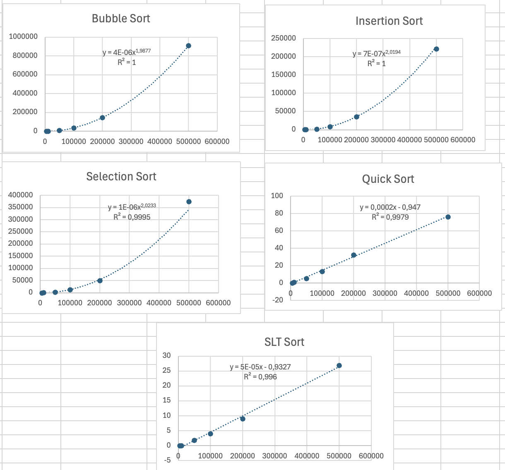

<h1 style="text-align: center;">
    Tarea 4 <br><br>
    Estructuras de Datos y Algoritmos para Ingeniería
</h1>

<h3 style="text-align: center;">
    Profesor: Esteban Badilla Alvarado <br><br>
    Estudiante: Rodrigo Sánchez Araya, C37259
</h3>

## Instrucciones para Ejecución de los Programas

1. **Ubicación:**
   - Asegúrese de que el `Makefile` se encuentre en el mismo directorio donde está la carpeta `GestorProyectos` o  `BenchMark`, que contiene los archivos fuente (`.cpp`) y cabeceras (`.hpp`).
   - El `Makefile` y las carpeta `GestorProyectos` o  `BenchMark` deben estar en el mismo nivel dentro de una estructura de directorios.

2. **Preparar el Entorno:**
   - **Para Windows:**
     - Se debe tener un compilador compatible con `g++` instalado.
     - Abrir una ventana de comandos (cmd) o PowerShell.
   - **Para Linux:**
     - Asegúrese de tener instalado `g++` y `make`. En la mayoría de las distribuciones, puedes instalarlos con:
       ```bash
       sudo apt-get install build-essential 
       ```
     - Abrir la terminal.

3. **Compilador de Programas:**
    - Navegue hasta el directorio donde se encuentra el `Makefile` utilizando el comando `cd`:
     ```bash
        # En este caso, puede que la ruta sea la siguiente en caso de querer ejecutar el gestor de proyectos:
        cd ./ie0217/Tareas/Tarea4/GestorProyectos
        # En este caso, puede que la ruta sea la siguiente en caso de querer ejecutar el BenchMark:
        cd ./ie0217/Tareas/Tarea4/BenchMark
     ```
    - Una vez en el directorio, ejecute el siguiente comando:
        - Para GestorProyectos:
        ```bash
         make
        ```
        - Para BenchMark: 
            
        ```bash
	    make    #Compila todos los ejecutables.
	    make bubble_sort_exec  # Ejecuta el algoritmo Bubble Sort."
	    make quick_sort_exec # Ejecuta el algoritmo Quick Sort."
	    make selection_sort_exec # Ejecuta el algoritmo Selection Sort."
	    make run ARGS='...' # Ejecuta el programa de benchmarking con los argumentos especificados." - Por ejemplo: make run ARGS='5000 bubble'"
	    make run_benchmarks  # Ejecuta el programa de benchmarking 10 veces para los tamaños 5000, 10000, 50000, 100000, 200000, y 500000."
	    make clean         #   Limpia los archivos generados."
	    make help        #     Muestra la ayuda."       

        ```
4. **Ejecutar Programas:**
   - Detalla aquí cómo se pueden ejecutar los programas generados después de la compilación. Por ejemplo:
     ```bash
     ./bubble_sort_exec
     ./quick_sort_exec
     ./selection_sort_exec
     ```

5. **Limpiar los Archivos Generados:**
   - Para limpiar los archivos generados y recompilar desde cero, use:
     ```bash
     make clean
     ```

---

## Preguntas de la Parte Teórica

1. **¿Qué es un algoritmo de ordenamiento y por qué son importantes en programación?**
   - **R/** Los algoritmos de ordenamiento son procedimientos que tienen como finalidad reorganizar los elementos de una lista o arreglo en un orden específico, que puede ser ascendente o descendente. Facilitan la búsqueda y la organización de datos.

2. **Explique el funcionamiento del algoritmo de ordenamiento “Bubble Sort”.**
   - **R/** Bubble Sort es un algoritmo que compara cada par de elementos adyacentes en la lista y los intercambia si están en el orden incorrecto. Este proceso se repite varias veces hasta que no se requieren más intercambios, lo que indica que la lista está ordenada. Su complejidad temporal es O(n^2) en el peor de los casos.

3. **Explique el funcionamiento del algoritmo de ordenamiento “Selection Sort”.**
   - **R/** Selection Sort divide la lista en una parte ordenada y otra desordenada. En cada iteración, selecciona el elemento más pequeño de la parte desordenada y lo intercambia con el primer elemento de esta sección. Este proceso continúa hasta que toda la lista está ordenada. Su complejidad temporal también es O(n^2).

4. **Describa el algoritmo de ordenamiento “QuickSort”. ¿Cuál es su ventaja principal sobre otros algoritmos de ordenamiento?**
   - **R/** QuickSort es un algoritmo de ordenamiento que utiliza el enfoque de divide y vencerás. Selecciona un "pivote" y divide el arreglo en dos subarreglos: uno con elementos menores que el pivote y otro con elementos mayores. Luego, aplica recursivamente el mismo proceso a los subarreglos. Su principal ventaja es que, en promedio, tiene una complejidad temporal de O(n log n), lo que lo hace más eficiente que otros algoritmos en muchos casos.

5. **Explique el concepto de complejidad temporal y cómo se aplica a los algoritmos de ordenamiento.**
   - Discuta la complejidad temporal de algoritmos de ordenamiento comunes como Bubble Sort, Insertion Sort, Quick Sort, Selection Sort, y la función std::sort de la STL.
   - **R/** La complejidad temporal mide el tiempo que un algoritmo tarda en ejecutarse en función del tamaño de su entrada. Se utiliza para comparar la eficiencia de diferentes algoritmos. En el caso de los algoritmos de ordenamiento, se analiza su rendimiento en el mejor, promedio y peor de los casos.

6. **¿Cuál es la diferencia entre los algoritmos de ordenamiento estables e inestables?**
   - Proporcione ejemplos de algoritmos de ordenamiento estables e inestables y explique por qué la estabilidad puede ser importante en ciertos escenarios.
   - **R/** Un algoritmo de ordenamiento es estable si mantiene el orden relativo de los elementos iguales. Por ejemplo, Merge Sort es estable, mientras que QuickSort es inestable. La estabilidad es importante en situaciones donde el orden original de los elementos iguales tiene significado.

7. **¿Cómo funciona la función std::sort de la STL y qué algoritmo de ordenamiento utiliza internamente?**
   - Discuta la complejidad de std::sort y por qué a menudo es más eficiente que los algoritmos de ordenamiento implementados manualmente.
   - **R/** La función std::sort utiliza un algoritmo híbrido llamado IntroSort, que combina QuickSort, HeapSort y Insertion Sort. Su complejidad promedio es O(n log n), y a menudo es más eficiente que los algoritmos de ordenamiento implementados manualmente debido a su optimización y uso de técnicas avanzadas.

8. **Explique la importancia de hacer benchmarks en los algoritmos de ordenamiento.**
   - ¿Qué factores se deben considerar al hacer benchmarks de diferentes algoritmos de ordenamiento y cómo se pueden interpretar estos benchmarks?
   - **R/** Los benchmarks son esenciales para evaluar el rendimiento de los algoritmos en diferentes escenarios y tamaños de datos. Permiten identificar cuál algoritmo es más eficiente en situaciones específicas, ayudando a tomar decisiones informadas sobre qué algoritmo utilizar.

9. **Compare el uso de memoria de diferentes algoritmos de ordenamiento.**
   - Discuta cómo algoritmos como Quick Sort y Merge Sort usan la memoria de manera diferente, incluyendo su complejidad espacial.
   - **R/** Algoritmos como Merge Sort requieren espacio adicional para los arreglos temporales utilizados en su proceso, mientras que QuickSort es más eficiente en términos de memoria, ya que puede realizar el ordenamiento en el mismo arreglo. La complejidad espacial de QuickSort es O(log n) en promedio, mientras que Merge Sort es O(n).

10. **¿Cómo se elige el algoritmo de ordenamiento más adecuado para un conjunto de datos dado?**
    - Discuta los factores que influyen en la elección de un algoritmo de ordenamiento, como el tamaño del conjunto de datos, su orden inicial y la necesidad de estabilidad.
    - **R/** La elección del algoritmo depende del tamaño del conjunto de datos, su orden inicial y la necesidad de estabilidad. Por ejemplo, para conjuntos de datos pequeños, Insertion Sort puede ser eficiente, mientras que para grandes volúmenes, QuickSort o Merge Sort son preferibles.

11. **Nombre cinco contenedores diferentes de la STL y explique brevemente en qué situaciones sería apropiado usar cada uno.**
    - **R/**
        - vector: Para colecciones de tamaño dinámico con acceso rápido.
        - list: Para operaciones frecuentes de inserción y eliminación en cualquier parte.
        - deque: Para acceso eficiente en ambos extremos.
        - set: Para almacenar elementos únicos en orden.
        - map: Para pares clave-valor, donde las claves son únicas.

12. **Explique qué son los adaptadores de contenedores y brinde un ejemplo para el cual se podría implementar.**
    - **R/** Los adaptadores de contenedores son estructuras que permiten modificar el comportamiento de los contenedores estándar. Por ejemplo, stack es un adaptador que utiliza deque o vector para proporcionar una interfaz de apilamiento.

13. **Explique el concepto de iteradores en la STL y cómo se utilizan para acceder a elementos en contenedores.**
    - **R/** Los iteradores son objetos que permiten recorrer elementos en un contenedor. Actúan como punteros y proporcionan operaciones como incrementar y desreferenciar para acceder a los elementos de forma segura.

14. **Mencione y explique 3 diferentes operaciones soportadas por iteradores en STL. ¿Cuál es la forma de definirlas en el código?**
    - **R/**
        - Incremento (++): Mueve el iterador al siguiente elemento.
        - Desreferenciación (*): Accede al valor del elemento actual.
        - Comparación (==, !=): Compara dos iteradores para verificar si apuntan al mismo elemento.

15. **¿Qué implementaciones se pueden hacer con iteradores de acceso aleatorio? ¿Cuál es la diferencia principal con los iteradores bidireccionales?**
    - **R/** Los iteradores de acceso aleatorio permiten saltar a cualquier elemento en un contenedor, como en un arreglo. La diferencia con los iteradores bidireccionales es que estos últimos solo permiten avanzar y retroceder una posición, mientras que los de acceso aleatorio permiten acceder directamente a cualquier posición.

16. **Proporcione ejemplos de al menos tres algoritmos de la STL y describa sus funciones básicas.**
    - **R/**
        - std::sort: Ordena un rango de elementos.
        - std::find: Busca un elemento en un rango.
        - std::copy: Copia un rango de elementos a otro.

17. **¿Cómo podría utilizar un algoritmo personalizado con la STL?**
    - **R/** Se puede crear un algoritmo que implemente la lógica deseada y utilizarlo con los contenedores de la STL, asegurándose de que cumpla con las condiciones necesarias para interactuar con ellos.

18. **¿Cuál es el papel de los templates en la implementación de funciones de ordenamiento?**
    - Explique cómo los templates se pueden utilizar para crear funciones de ordenamiento genéricas que funcionen con diferentes tipos de datos.
    - **R/** Los templates permiten crear funciones genéricas que pueden operar sobre diferentes tipos de datos, haciendo que el código sea más flexible y reutilizable.

19. **Explique de qué forma se implementan Templates con múltiples parámetros en C++.**
    - **R/** Los templates con múltiples parámetros se implementan usando la sintaxis `template<typename T1, typename T2>`, permitiendo crear funciones o clases que acepten diferentes tipos.

20. **¿Qué son las excepciones en C++ y cómo se pueden usar para manejar errores durante las operaciones de ordenamiento?**
    - Proporcione un ejemplo de cómo usar excepciones para manejar un posible error en un algoritmo de ordenamiento.
    - **R/** Las excepciones son mecanismos para manejar errores en C++. Se pueden utilizar para capturar y gestionar errores como fallos de asignación de memoria, lanzando una excepción cuando ocurre un error.

21. **Describa los bloques try, catch y throw y cómo se utilizan para el manejo de excepciones en C++.**
    - **R/**
        - try: Contiene el código que puede lanzar una excepción.
        - catch: Captura y maneja la excepción lanzada.
        - throw: Se utiliza para lanzar una excepción cuando se detecta un error.

22. **Nombre al menos tres excepciones estándar proporcionadas por C++ y proporciona ejemplos de situaciones en las que podrían ser útiles.**
    - **R/**
        - std::bad_alloc: Ocurre cuando falla la asignación de memoria.
        - std::out_of_range: Se lanza cuando se intenta acceder a un índice fuera del rango de un contenedor.
        - std::invalid_argument: Se utiliza cuando un argumento a una función no es válido.

23. **¿Cuál es la forma de manejar errores inesperados o no considerados durante la elaboración del código?**
    - **R/** Se puede implementar un bloque catch general para capturar excepciones no manejadas y registrar información sobre el error.

24. **Describa cómo las expresiones regulares se pueden usar para validar o filtrar datos antes del ordenamiento.**
    - Proporcione un ejemplo de un escenario en el que la validación de datos mediante expresiones regulares sea necesaria antes de realizar el ordenamiento.
    - **R/** Las expresiones regulares permiten definir patrones que los datos deben cumplir antes de ser procesados, asegurando que solo los datos válidos sean ordenados.

25. **Enumere al menos tres caracteres especiales comúnmente utilizados en expresiones regulares y describa sus funciones.**
    - **R/**
        - .: Coincide con cualquier carácter.
        - \d: Coincide con un dígito.
        - ^: Indica el inicio de una línea.

26. **¿Cuál es la diferencia entre std::regex_match y std::regex_search en C++?**
    - **R/**
        - std::regex_match: Verifica si toda la cadena coincide con el patrón.
        - std::regex_search: Busca una coincidencia del patrón en cualquier parte de la cadena.

27. **¿Cómo se puede utilizar std::regex_replace en C++ para modificar cadenas de texto?**
    - **R/** Permite reemplazar coincidencias de un patrón en una cadena por un nuevo texto, facilitando la manipulación de datos.

28. **¿Qué es un Makefile y cómo se puede usar para automatizar la compilación de un programa en C++ con múltiples algoritmos de ordenamiento?**
    - Describa cómo escribiría un Makefile que compile diferentes algoritmos de ordenamiento en ejecutables separados.
    - **R/** Un Makefile es un archivo que contiene instrucciones para compilar programas. Permite definir reglas para la creación de ejecutables a partir de archivos fuente. Un ejemplo de un Makefile para compilar múltiples algoritmos de ordenamiento podría ser:
```Makefile
# Variables
CC = g++
CXXFLAGS = -Wall -std=c++11

# Detectar el sistema operativo
ifeq ($(OS),Windows_NT)
    EXE_EXT = .exe
    RM = del
    RUN = $(TARGET_BENCHMARK)$(EXE_EXT)
else ifeq ($(shell uname), Darwin)
    EXE_EXT =
    RM = rm -f
    RUN = ./$(TARGET_BENCHMARK)
else
    EXE_EXT =
    RM = rm -f
    RUN = ./$(TARGET_BENCHMARK)
endif

# Definir los ejecutables para los algoritmos de ordenamiento
TARGET_BUBBLE = bubble_sort_exec
TARGET_QUICK = quick_sort_exec
TARGET_SELECTION = selection_sort_exec
TARGET_BENCHMARK = sorting      # Programa de benchmarking

# Archivos fuente
SRCS = main.cpp \
       Sorting.cpp

# Objetivos principales
all: $(TARGET_BUBBLE) $(TARGET_QUICK) $(TARGET_SELECTION) $(TARGET_BENCHMARK)$(EXE_EXT)

# Regla para compilar el ejecutable de Bubble Sort
$(TARGET_BUBBLE): Sorting.o main.o
	$(CC) $(CXXFLAGS) -o $@ Sorting.o main.o -DBUBBLE

# Regla para compilar el ejecutable de Quick Sort
$(TARGET_QUICK): Sorting.o main.o
	$(CC) $(CXXFLAGS) -o $@ Sorting.o main.o -DQUICK

# Regla para compilar el ejecutable de Selection Sort
$(TARGET_SELECTION): Sorting.o main.o
	$(CC) $(CXXFLAGS) -o $@ Sorting.o main.o -DSELECTION

# Regla para compilar el programa de benchmarking
$(TARGET_BENCHMARK)$(EXE_EXT): $(SRCS)
	$(CC) $(CXXFLAGS) -o $@ $(SRCS)

# Compilación de los archivos .cpp a .o
Sorting.o: Sorting.cpp Sorting.hpp
	$(CC) $(CXXFLAGS) -c Sorting.cpp

main.o: main.cpp Sorting.hpp
	$(CC) $(CXXFLAGS) -c main.cpp

# Regla de limpieza
clean:
	$(RM) *.o $(TARGET_BUBBLE) $(TARGET_QUICK) $(TARGET_SELECTION) $(TARGET_BENCHMARK)$(EXE_EXT)

```

 En este ejemplo, el Makefile define cómo compilar diferentes algoritmos de ordenamiento en ejecutables separados.

# discusión datos obtenidos en las gráficas


Se muestra acontinuación los gráficos obtenidos durante el BenchMark: 


Para el Bubble sort se sabe que, la complejidad es O(n^2) y se puede ver en los gráficos que es correcto con un exponente en la x que es casi 2. De igual manera para con el insertion sort y selection sort. En contraparte, el Quick sort y el SLT sort trabajan como un O(n log n) donde se puede ver que, lo obtenido en las graficas es casi lineal más no al 100% por el tipo de ajuste que llegan a presentar, esto dejando interpretar que si tiene ese comportamiento esperado.


En resumen: 

| Algoitmo     | Complejidad Esperada | Complejidad obtenida con gráfica |
|-----------------|-----------------|---------------|
| Bubble Sort     | O(n^2)          |  $y = 4\cdot10^{-06}x^{1,9877}$        |
| Selection Sort  | O(n^2)          |    $y = 1\cdot10^{-06}x^{2,0233}$           |
| Insertion Sort  | O(n^2)          |    $y = 7\cdot10^{-07}x^{2,0194}$           |
| Quick Sort      | O(n log n)      |       $y = 0,0002x - 0,947$        |
| SLT Sort        | O(n log n)      |       $y = 510^{-05}x - 0,9327$        |
