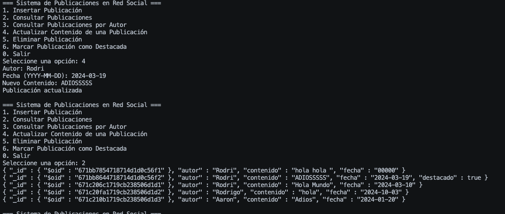

<h1 style="text-align: center;">
    Tarea 5 <br><br>
    Estructuras de Datos y Algoritmos para Ingeniería
</h1>

<h3 style="text-align: center;">
    Profesor: Esteban Badilla Alvarado <br><br>
    Estudiante: Rodrigo Sánchez Araya, C37259
</h3>

## Instrucciones para Ejecución de los Programas


1. **Preparar el Entorno:**
   - **Para Windows:**
     - Se debe tener un compilador compatible con `g++` instalado.
     - Abrir una ventana de comandos (cmd) o PowerShell.
   - **Para Linux:**
     - Asegúrese de tener instalado `g++` y `make`. En la mayoría de las distribuciones, puedes instalarlos con:
       ```bash
       sudo apt-get install build-essential 
       ```
     - Abrir la terminal.

2. **Ubicación**
    - Navegue hasta el directorio donde se encuentra el `Makefile` utilizando el comando `cd`:
     ```bash
        # En este caso, puede que la ruta sea la siguiente:
        cd ./ie0217/Tareas/Tarea5/
     ```
4. **Ejecución del programa**
- Ejecute el comando ``make`` para crear los ejecutables de los programas, en caso de que quiera ejecutarlos manualmente: 

```bash
cd ./Ejecutables

# Posteriormente: 

# Si quiere ejecutar el archivo del Sistema de publicaciones

./SistemaPubliRedSocial

# Si quiere ejecutar el archivo del Sistema de resenas de profesores y cursos

./SistemaResenProfyCursos

```

- En caso contrario puede ejecutar directamente desde Tarea5: 

```bash
# Para el sistema de Red social
make run_pubred

# Para el sistema de Resenas de Profesores

make run_rescp
```


## Parte Teórica

1. **Explique la diferencia entre bases de datos relacionales y no relacionales en términos de estructura de datos, casos de uso y escalabilidad.**  
  **R/** Las bases de datos **relacionales** utilizan una estructura tabular con tablas relacionadas entre sí, son ideales para aplicaciones con transacciones complejas y requieren consistencia. Las **no relacionales** (NoSQL) usan estructuras flexibles (como documentos o pares clave-valor), son escalables horizontalmente y adecuadas para grandes volúmenes de datos no estructurados.

2. **¿Qué es SQL y cuál es su importancia en la gestión de bases de datos relacionales? Mencione algunos ejemplos de operaciones comunes que se pueden realizar con SQL.**  
   **R/** SQL (Structured Query Language) es un lenguaje de consulta estructurado esencial para administrar y manipular bases de datos relacionales. Operaciones comunes incluyen `SELECT` para recuperar datos, `INSERT` para agregar nuevos registros, `UPDATE` para modificar datos existentes, y `DELETE` para eliminar registros.

3. **Mencione y explique los componentes de una tabla de bases de datos SQL.**  
  **R/** Los componentes de una tabla SQL incluyen **filas** (cada registro individual), **columnas** (atributos de los registros), **clave primaria** (identificador único), y **claves foráneas** (vinculan tablas relacionadas).

4. **Explique en qué consisten las operaciones CRUD y cómo se implementan en bases de datos relacionales y no relacionales.**  
   **R/** CRUD se refiere a las operaciones de **Crear (Create)**, **Leer (Read)**, **Actualizar (Update)** y **Eliminar (Delete)** datos. En bases de datos relacionales se implementan mediante comandos SQL; en NoSQL, se utilizan métodos específicos del sistema, como operaciones en documentos o pares clave-valor.

5. **Mencione y explique tres comandos SQL básicos, indicando un ejemplo práctico de cómo y cuándo se utilizan.**  
**R/** 
   - `SELECT`: Recupera datos de una tabla. Ejemplo: `SELECT * FROM usuarios;`
   - `INSERT`: Agrega nuevos datos. Ejemplo: `INSERT INTO usuarios (nombre) VALUES ('Carlos');`
   - `DELETE`: Elimina registros. Ejemplo: `DELETE FROM usuarios WHERE id=1;`

6. **Mencione y explique tres comandos SQL de nivel intermedio o avanzado y su importancia en la manipulación de datos.**  
**R/**
   - `JOIN`: Permite combinar datos de varias tablas relacionadas.
   - `GROUP BY`: Agrupa resultados en categorías, útil para estadísticas.
   - `HAVING`: Filtra datos después de usar `GROUP BY`.

7. **Explique qué es un JOIN en SQL y describa al menos tres tipos de JOIN (INNER, LEFT, RIGHT). Mencione cuándo y por qué usar cada uno.**  
**R/**
   `JOIN` es una operación que combina datos de múltiples tablas. `INNER JOIN` muestra registros coincidentes; `LEFT JOIN` mantiene todos los registros de la tabla izquierda; `RIGHT JOIN` muestra todos los registros de la derecha.

8. **Dada la tabla Productos, realiza una consulta para obtener los nombres y precios de los productos de la categoría "Electrónica" o "Deportes", que están en stock y cuyo precio sea menor a 300. Además, utiliza un alias para que el campo precio se muestre como costo, y ordena los resultados de menor a mayor precio.**  
**R/**
   ```sql
   SELECT nombre, precio AS costo
   FROM productos
   WHERE categoria IN ('Electrónica', 'Deportes') AND en_stock = true AND precio < 300
   ORDER BY costo ASC;
   ```

9. **¿Cómo podrías seleccionar los nombres de los productos que tienen el color "azul" en su información de detalles (detalles_color) y que pesen menos de 1 kg (detalles_peso)? Ordena los resultados en orden alfabético por nombre.**
**R/**
```sql
SELECT nombre
FROM productos
WHERE detalles_color = 'Azul' AND detalles_peso < 1
ORDER BY nombre ASC;
```

10. **Dada la tabla Productos, realiza una consulta para obtener el precio promedio de todos los productos en la categoría "Hogar" que están disponibles en inventario.**
**R/**
```sql
SELECT AVG(precio) AS precio_prom
FROM productos
WHERE categoria = 'Hogar' AND en_stock = true;
```

11. **¿En qué consiste un ataque de SQL Injection y cómo puede afectar a una base de datos? Menciona al menos tres prácticas recomendadas para prevenir este tipo de ataques en una aplicación que utiliza consultas SQL.**

**R/** SQL Injection ocurre cuando un atacante inserta código SQL malicioso en una consulta, permitiéndole acceder, modificar o eliminar datos no autorizados. Para prevenirlo:

- Utilizar consultas preparadas y parámetros.
- Validar y sanitizar las entradas del usuario.
- Restringir permisos de acceso a la base de datos.

12. **Explique el rol de un servidor y un cliente en un sistema de gestión de bases de datos (DBMS). ¿Cómo interactúan ambos en una arquitectura cliente-servidor y qué características tienen?**

**R/** En un DBMS, el servidor aloja la base de datos y responde a las solicitudes, mientras que el cliente realiza consultas y recibe datos. En una arquitectura cliente-servidor, los clientes envían solicitudes al servidor de base de datos, que procesa y devuelve los resultados.

13.**¿Qué es un motor de bases de datos? Mencione tres ejemplos.**

**R/** Un motor de base de datos es el software que permite crear, leer, actualizar y eliminar datos en una base de datos. Ejemplos incluyen MySQL, PostgreSQL y SQLite.

14. **Explique en qué situaciones es conveniente usar MySQL, considerando el tamaño de la base de datos, el tipo de datos y el tipo de aplicación.**

**R/** MySQL es conveniente para aplicaciones web, bases de datos de tamaño mediano a grande que requieren alta disponibilidad, y estructuras de datos bien definidas. Es popular en aplicaciones LAMP (Linux, Apache, MySQL, PHP) debido a su escalabilidad y soporte para transacciones.

15. **¿Qué características de una base de datos hacen conveniente el uso de SQLite?**
**R/** SQLite es ideal para aplicaciones móviles o embebidas, ya que es ligera, requiere poca configuración, y almacena datos en un solo archivo. No requiere servidor, lo cual es ventajoso para aplicaciones con bajo volumen de datos y uso individual.

16. **Explique cada uno de los tipos de bases de datos NoSQL vistos en clase (clave-valor, familia de columnas, grafos y documentales). Mencione un beneficio específico del uso de cada uno y proporcione un ejemplo de comando o consulta.**

**R/** 

- Clave-Valor: Almacena pares clave-valor, ideal para sesiones de usuario. Ejemplo: ``GET usuario:123``.
- Familia de Columnas: Usa columnas dinámicas, ideal para análisis masivos. Ejemplo: ``SELECT columna1 FROM tabla``.
- Grafos: Conecta nodos y relaciones, ideal para redes sociales. Ejemplo: ``MATCH (n) RETURN n``.
- Documentales: Almacena documentos JSON, ideal para datos heterogéneos. Ejemplo: db.collection.find({"campo": "valor"}).

17. **¿Qué es una colección en MongoDB? ¿Cuál es la diferencia que tiene con respecto a una tabla?**
**R/** En MongoDB, una colección es un conjunto de documentos almacenados, similar a una tabla en bases de datos relacionales. Sin embargo, los documentos dentro de una colección no tienen una estructura fija, a diferencia de las filas de una tabla.

18. **¿Cuáles son las principales diferencias en el rendimiento y escalabilidad entre bases de datos SQL y NoSQL?**
**R/** Las bases de datos SQL suelen escalar verticalmente y priorizan la consistencia y transacciones ACID, mientras que las NoSQL escalan horizontalmente y priorizan flexibilidad y velocidad, siendo más adecuadas para aplicaciones distribuidas y de gran volumen de datos.

## Ejecución del Makefile


## Sistema de Reseñas de Cursos y Profesores

Para este sistema de reseñas lo que se plantea a la hora de resolverlo es, realizar la implementacino de 3 tablas como solicita el ejercicio, en primer lugar pues realizar una especie de gerarquía que empieza con la tabla de profesores que se asocia a la de cursos mediante su foreing key y por ultimo a la de reseñas con esta misma idea, como si fuera una especie de lista enlazada entre tablas. 

Para la inserción de datos dentro de la base de datos se realiza la siguiente metodología de ingresar datos mediante la db por terminal: 


Primera ejecución del programa: 


### Filtrado por curso y escuela

Se permite al usuario ingresar el nombre de una escuela y muestra los cursos de esta escuela ordenados por promedio de calificación (de mayor a menor) y luego por dificultad (de menor a mayor).

-> Se solicita el nombre de la escuela y se prepara una consulta SQL que una las tablas de cursos, reseñas y profesores. 
-> La función ejecuta la consulta y muestra los resultados en un formato tabular. Si no se encuentran cursos, se informa al usuario. 
-> Se liberan los recursos utilizados por la declaración preparada.


### Consulta y Ordenamiento por Calificación y Dificultad

Se permite al usuario ingresar el nombre de una escuela y muestra los cursos de esta escuela junto con su promedio de calificación y promedio de dificultad.

-> Se solicita el nombre de la escuela y se prepara una consulta SQL que une las tablas de cursos, reseñas y profesores.
-> La función ejecuta la consulta y muestra los resultados en un formato tabular, ordenados por promedio de calificación (de mayor a menor) y luego por promedio de dificultad (de menor a mayor). Si no se encuentran cursos, se informa al usuario.
-> Se liberan los recursos utilizados por la declaración preparada.

En este caso es la opción 7 del menú, ejecución: 


### Búsqueda de Reseñas no Revisadas

Se permite al usuario visualizar las reseñas no revisadas junto con la información del profesor y el curso asociado.

-> Se prepara una consulta SQL que une las tablas de reseñas, profesores y cursos para seleccionar las reseñas que no han sido revisadas.
-> La función ejecuta la consulta y muestra los resultados en un formato tabular que incluye el nombre del profesor, el curso correspondiente y el comentario de la reseña. Si no hay reseñas pendientes de revisión, se informa al usuario.
-> Se liberan los recursos utilizados por la declaración preparada.

En este caso es la opción 6 del menú, ejecución: 


### Actualización de Estado de Reseñas

La función permite al usuario buscar reseñas que no han sido revisadas y actualizar su estado a "revisada".

-> Se ejecuta una consulta SQL para seleccionar las reseñas no revisadas de la base de datos, mostrando el ID y el texto de cada reseña.
-> Si se encuentran reseñas, se solicita al usuario el ID de la reseña que desea actualizar.
-> La función ejecuta otra consulta para actualizar el estado de la reseña seleccionada a revisada.
-> Si no hay reseñas no revisadas, se informa al usuario mediante un mensaje.
-> Se liberan los recursos utilizados por las declaraciones preparadas.

En este caso es la opción 8 del menú, ejecución: 


### Consulta con Filtración Compleja y Alias


### Consulta para Eliminar Reseñas


### Salir del programa


## Sistema de Publicaciones en Red Social
Este programa gestiona publicaciones en una colección de MongoDB. Proporciona funciones para:

-> Insertar: Añadir nuevas publicaciones.
-> Consultar: Recuperar publicaciones, ordenándolas por fecha o filtrando por autor.
-> Actualizar: Modificar el contenido de publicaciones existentes.
-> Eliminar: Borrar publicaciones específicas.
-> Marcar como Destacada: Actualizar el estado de una publicación como destacada o no.
-> El programa utiliza la biblioteca mongocxx para interactuar con la base de datos y maneja excepciones para asegurar robustez.


### Insertar una Publicación y consulta de publicaciones:


#### Consultar publicaciones por autor

Se agregan mas publicaciones para poder hacer la busqueda por autor: 


Busqueda de Aaron: 


### Actualizar Contenido de una Publicación


### Eliminar una Publicación


### Marcar Publicación como Destacada
Se marca como destacada: 

