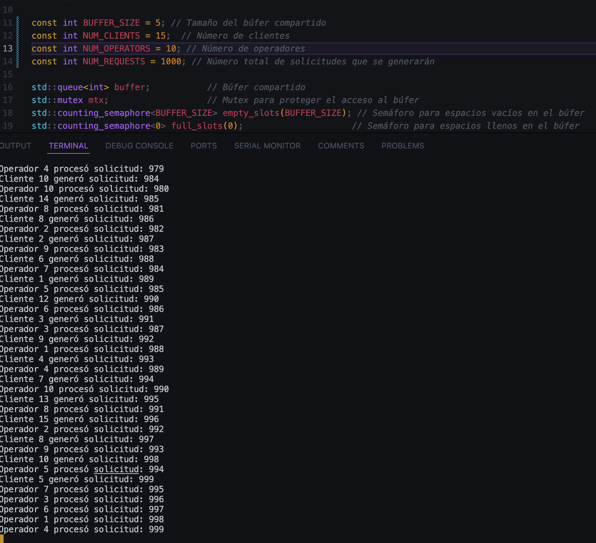

<h1 style="text-align: center;">
    Tarea #6 <br><br>
    Estructuras de Datos y Algoritmos para Ingeniería
</h1>

<h3 style="text-align: center;">
    Profesor: Esteban Badilla Alvarado <br><br>
    Estudiante: Rodrigo Sánchez Araya, C37259
</h3>


## Parte teórica


**1. ¿Cuál es la diferencia entre un proceso y un hilo en programación? Mencione:**  

a) Diferencias en el  uso de memoria.


- Proceso: Cada proceso tiene su propio espacio de direcciones de memoria, es decir, una porción de la memoria principal (RAM) que es independiente de otros procesos. Incluye su propia pila, segmento de datos, de código, entre otros. No comparten memoria a menos que utilicen técnicas de comunicación entre procesos.


- Hilo: Los hilos de un mismo proceso comparten el mismo espacio de direcciones de memoria. Esto significa que comparten las mismas variables globales, pila y datos del proceso, cada hilo tiene sy propia pila de ejecuciión.


b) Tres características importantes de los procesos.

- Aislamiento: Los procesos están aislados unos de otros. Un proceso no puede acceder directamente a la memoria de otro proceso sin utilizar mecanismos de IPC, lo cual proporciona seguridad y estabilidad al sistema.

- Cambio de contexto: Cambiar de un proceso a otro (cambio de contexto) es una operación relativamente costosa en términos de tiempo y recursos, ya que el sistema operativo debe guardar y restaurar el estado completo del proceso (registro de la CPU, pila, memoria, etc.).

- Independencia: Un fallo en un proceso no afecta directamente a otros procesos. Si un proceso se bloquea o falla, los demás procesos pueden continuar ejecutándose sin problemas.


c) Tres características importantes de los hilos.

- Compartición de recursos: Los hilos del mismo proceso comparten el mismo espacio de direcciones de memoria y recursos, lo que permite una comunicación más eficiente y rápida entre ellos sin necesidad de IPC.

- Cambio de contexto rápido: Cambiar de un hilo a otro dentro del mismo proceso es más rápido y eficiente que cambiar de un proceso a otro, ya que los hilos comparten el mismo espacio de direcciones de memoria y muchos recursos.

- Concurrencia: Los hilos permiten la concurrencia dentro de un proceso, lo que significa que diferentes partes de un programa pueden ejecutarse simultáneamente, mejorando el rendimiento y la capacidad de respuesta del programa.


**2.  ¿Qué es la multitarea? ¿Se realiza de manera paralela o concurrente?**

Multitarea es la capacidad de un sistema operativo para ejecutar múltiples tareas o procesos de manera simultánea. Puede realizarse de manera paralela o concurrente:

- Paralela: Tareas ejecutándose literalmente al mismo tiempo, típicamente en sistemas con múltiples núcleos de CPU.

- Concurrente: Tareas progresando de manera aparentemente simultánea, con el sistema operativo alternando rápidamente entre ellas en un solo núcleo de CPU.


a) Proporcione un ejemplo de uso de multirarea.

- Un ejemplo común es el uso de un sistema operativo que permite al usuario navegar por Internet, editar documentos y reproducir música al mismo tiempo.


b) Mencione qué mecanismos de comunicación se usan comúnmente en la multirarea.

- Pipes: Permiten la comunicación entre procesos a través de un flujo de bytes.

- Colas de mensajes: Facilitan el intercambio de mensajes entre procesos.

- Memoria compartida: Permite que múltiples procesos accedan a la misma región de memoria.

- Sockets: Utilizados para la comunicación a través de una red.


**3. Explique cómo se genera un proceso paralelo en una computadora.**


Procesos paralelos son aquellos que se ejecutan simultáneamente en diferentes núcleos de CPU.


a) ¿Cómo se dividen las tareas para ser ejecutadas en paralelo?

- Descomposición de tareas: Dividir el trabajo en tareas más pequeñas que pueden ejecutarse simultáneamente.

- Asignación a núcleos: Distribuir estas tareas a diferentes núcleos de CPU.


b) ¿Qué factores afectan la eficiencia de los procesos paralelos?

- Comunicación entre procesos: Un exceso de comunicación puede crear cuellos de botella.

- Balance de carga: Distribución desigual del trabajo entre los núcleos puede llevar a ineficiencias.

- Interferencia de caché: Accesos a la memoria compartida pueden causar conflictos en la caché.

**4. ¿Cómo funcionan las tareas concurrentes?**

Las tareas concurrentes son aquellas que avanzan de manera intercalada, permitiendo que múltiples tareas progresen al mismo tiempo.

a) ¿Qué mecanismos de sincronización se utilizan para coordinar las tareas concurrentes?

- Mutexes: Aseguran que solo un hilo puede acceder a un recurso a la vez.

- Semáforos: Controlan el acceso a recursos compartidos mediante contadores.

- Barreras: Sincronizan los hilos en puntos específicos para asegurar que todos alcanzan un punto antes de continuar.


b) Mencione los desafíos más comunes de la programación concurrente.


- Condiciones de carrera: Ocurren cuando múltiples hilos acceden y modifican datos compartidos simultáneamente.

- Deadlocks: Situaciones donde dos o más hilos se bloquean mutuamente esperando recursos.

- Interbloqueos: Similares a los deadlocks, pero involucran más hilos y recursos en un ciclo de espera circular.

**5. Mencione las diferencias entre un multinúcleo y un multiprocesador.**

- Multinúcleo: Un solo chip de CPU que contiene múltiples núcleos de procesamiento.

- Multiprocesador: Sistema con múltiples CPU físicas.

**6. Mencione las diferencias entre memoria compartida y distribuida.**

- Memoria compartida: Todos los procesos comparten un único espacio de direcciones de memoria.

- Memoria distribuida: Cada proceso tiene su propio espacio de direcciones y la comunicación se realiza a través de una red.

**7. ¿Qué es una condición de carrera y qué problemas podría implicar en un sistema concurrente?**

**8. Explique tres mecanismos utilizados para evitar condiciones de carrera en memoria compartida:**

- Mutex (Exclusión Mutua): Un mutex permite que solo un hilo acceda a la memoria compartida a la vez. El hilo que obtiene el mutex puede realizar sus operaciones y luego debe liberarlo para que otros puedan acceder.

- Semáforos: Son contadores que controlan el acceso a los recursos. Un semáforo binario funciona como un mutex, mientras que los semáforos contadores permiten un número limitado de accesos simultáneos, útil para recursos compartidos entre varios hilos.

- Variables de Condición: Estas permiten que un hilo espere hasta que se cumpla una condición específica antes de continuar. Se usan junto con mutexes para coordinar el acceso seguro a la memoria, facilitando la comunicación entre hilos.
a) Proporcione un ejemplo en C++ de la implementación de uno de estos mecanismos


```cpp
#include <iostream>
#include <thread>
#include <vector>
#include <mutex>

const int NUM_THREADS = 100;  // Número de hilos
const int NUM_INCREMENTS = 10000;  // Número de incrementos por hilo

int counter = 0;  // Contador compartido
std::mutex mtx;   // Mutex para proteger el acceso al contador

// Función que incrementa el contador sin protección
void increment_without_lock() {
    for (int i = 0; i < NUM_INCREMENTS; ++i) {
        counter++;
    }
}

// Función que incrementa el contador con protección de mutex
void increment_with_lock() {
    for (int i = 0; i < NUM_INCREMENTS; ++i) {
        std::lock_guard<std::mutex> lock(mtx);
        counter++;
    }
}

int main() {
    // Ejemplo 1: Incremento sin protección (condición de carrera)
    counter = 0;
    std::vector<std::thread> threads;

    for (int i = 0; i < NUM_THREADS; ++i) {
        threads.push_back(std::thread(increment_without_lock));
    }

    for (auto& th : threads) {
        th.join();
    }

    std::cout << "Resultado sin protección: " << counter << std::endl;

    // Ejemplo 2: Incremento con protección (uso de mutex)
    counter = 0;
    threads.clear();

    for (int i = 0; i < NUM_THREADS; ++i) {
        threads.push_back(std::thread(increment_with_lock));
    }

    for (auto& th : threads) {
        th.join();
    }

    std::cout << "Resultado con protección: " << counter << std::endl;

    return 0;
}

```

**9. Menciona las diferencias entre un modelo de memoria compartida y uno de paso de mensajes.**


- Comunicación:

    - Memoria compartida: Los procesos acceden a una memoria común.
    - Paso de mensajes: Los procesos envían y reciben mensajes, sin memoria compartida.
- Sincronización:

    - Memoria compartida: Requiere mecanismos como mutexes para evitar conflictos.  
    - Paso de mensajes: La sincronización se maneja con el intercambio de mensajes.
- Escalabilidad:

    - Memoria compartida: Funciona bien en sistemas de múltiples núcleos.
    - Paso de mensajes: Es más adecuado para sistemas distribuidos.

**10. Explique cuatro mecanismos de sincronización comunes y cómo se implementan en C++.**

- Mutexes:  Controla el acceso exclusivo a una sección crítica.

```cpp
std::mutex mtx;
std::lock_guard<std::mutex> guard(mtx);
```

- Semáforos: Limita el acceso simultáneo a un recurso.


```cpp
std::counting_semaphore<1> sem(1);
sem.acquire(); // bloquea
sem.release(); // libera
```
- Condiciones de variable:  Permite que un hilo espere hasta que se cumpla una condición.
```cpp
std::condition_variable cv;
std::mutex mtx;
cv.wait(lock, []{ return ready; });

```
- Barreras: sincroniza un conjunto de hilos en un punto, haciendo que todos esperen hasta que todos lleguen.

```cpp
#include <iostream>
#include <thread>
#include <vector>
#include <mutex>
#include <chrono>
#include <barrier>

// Mutex para proteger la salida en la terminal
// solo un hilo a la vez pueda imprimir en la consula.
// los mensajes no se van a mezclar.
std::mutex console_mutex;


// Barrera para sincronizar las tareas
// Lo que permite es sincronizar tres tareas. 
// Cada tarea se detiene hasta que todas las demas hayan llegado. 
// Solo cuando todas llegan, continua. 
std::barrier sync_point(3);


// Función que simula una tarea del sistema
//Recibe como parametro el id de la tarea para distinguir entre los hilos
void perform_task(int id) {
    {
        // Se bloquea la accion que tiene dentro de los corchetes donde se ecuentra
        // Bloqueo para asegurar que la salida no se mezcle
        // Para bloquear el mutex y que solo un hilo imprima en la consola a la vez
        std::lock_guard<std::mutex> lock(console_mutex);
        // Muestra un mensaje indicando que la tarea está comenzando a trabajar. 
        std::cout << "Tarea " << id << " está realizando trabajo inicial...\n";
    }

    // Simula trabajo con un retardo
    // establece x milisegundos para simular que se está trabjando en dicha tarea por ese x tiempo. 
    std::this_thread::sleep_for(std::chrono::milliseconds(100 * id));

    {
        // Bloqueo para asegurar que la salida no se mezcle
        // Para bloquear el mutex y que solo un hilo imprima en la consola a la vez
        std::lock_guard<std::mutex> lock(console_mutex);
        std::cout << "Tarea " << id << " alcanzó el punto de sincronización.\n";
    }

    // Sincronización en la barrera
    // Las tareas se sincronizan. 
    // Dice que si la tarea llegó al punto de barrera y espera a que las demás la alcancen. 
    // Cuando las otras lleguen, esta continua. 
    sync_point.arrive_and_wait();

    {
        // Se bloquea la accion que tiene dentro de los corchetes donde se ecuentra
        // Bloqueo para asegurar que la salida no se mezcle
        // Cuando las tareas pasan la barrera, continúa con el "trabajo final"
        std::lock_guard<std::mutex> lock(console_mutex);
        std::cout << "Tarea " << id << " continúa con el trabajo final.\n";
    }

    // Simula trabajo adicional con un retardo
    // Simula trabajo adicioal por otro y tiempo. 
    std::this_thread::sleep_for(std::chrono::milliseconds(50 * id));

    {
        // Se bloquea la accion que tiene dentro de los corchetes donde se ecuentra
        // Bloqueo para asegurar que la salida no se mezcle
        std::lock_guard<std::mutex> lock(console_mutex);
        // Imprime que la tarea ya termino ggs. 
        std::cout << "Tarea " << id << " ha completado el trabajo.\n";
    }
}

int main() {
    // Establece el numero de tareas a 3 -> tamaño de barrera. 
    const int NUM_TASKS = 3; // Número de tareas a ejecutar

    // Crea y lanza los hilos para ejecutar las tareas
    // Se hace uno para cada tarea. 
    // Los hilos ejecutan la funcion "perform_task" y recibe un id (1, 2 o 3). 
    std::vector<std::thread> threads;
    for (int i = 1; i <= NUM_TASKS; ++i) {
        threads.push_back(std::thread(perform_task, i));
    }

    // Espera a que todas las tareas terminen
    // se utiliza para esperar a que cada hilo termie su ejecución antes de continuar. 
    // El programa no termina hasta que todos los hilos termiaran su tarea. 
    for (auto& th : threads) { // Se accede a cada hilo por referencia
        th.join(); 
    }
    // ggs terminamos el pograma 
    std::cout << "Todas las tareas han completado su ejecución.\n";
    // Salir 
    return 0;
}
```

**11. ¿Cuáles son los costos de administración y creación de hilos?**

a) Mencione los recursos del sistema involucrados.

- CPU: Se usa para la planificación y cambio de contexto entre hilos, lo cual puede ser costoso cuando hay muchos hilos.
- Memoria: Cada hilo necesita memoria para su pila, estructuras de control y almacenamiento de estado.
- Tiempo de creación: La creación de hilos consume tiempo, ya que el sistema operativo asigna recursos y crea el entorno de ejecución de cada hilo.
- Sincronización: Los mecanismos para coordinar hilos, como mutexes y semáforos, requieren procesamiento y pueden ralentizar la ejecución cuando muchos hilos compiten por recursos.


b) ¿Qué estrategias usaría para optimizar el rendimiento de los hilos?

- Pool de hilos: Reutilizar un conjunto fijo de hilos en lugar de crear y destruir hilos constantemente reduce el costo de administración.
- Asignación de afinidad de CPU: Vincular hilos específicos a núcleos de CPU puede mejorar el rendimiento, evitando el cambio de contexto frecuente.
- Reducción de sincronización: Minimizar la dependencia entre hilos y reducir las secciones críticas ayuda a evitar bloqueos frecuentes.
- Tamaño óptimo de pila: Ajustar el tamaño de la pila para los hilos según sus necesidades evita el uso excesivo de memoria.


**12. ¿Cuáles son las ventajas de utilizar una herramienta de depuración al desarrollar un código?**

- Identificación rápida de errores: Permiten localizar errores específicos en tiempo real, indicando exactamente dónde falla el programa y facilitando su corrección.

- Análisis detallado del estado del programa: Permiten examinar variables, estructuras de datos y el flujo de ejecución, lo que ayuda a entender mejor el comportamiento del código en distintos momentos.

- Ejecución paso a paso: Facilitan ejecutar el código línea por línea o en bloques, permitiendo observar cómo cambia el estado del programa y ayudando a identificar problemas lógicos o errores sutiles.

- Optimización de rendimiento: Ayudan a detectar cuellos de botella en el código, como bucles ineficientes o consumo excesivo de recursos, permitiendo mejorar el rendimiento del programa.

- Reducción del tiempo de desarrollo: Al localizar errores de manera más eficiente, el tiempo de prueba y corrección de errores se reduce considerablemente, acelerando el ciclo de desarrollo.


**13. ¿Qué es un breakpoint y cómo se utilizan en un entorno de depuración?**


- Colocación de breakpoints: Se colocan en una línea específica del código, como en una función, bucle o condicional, en la que se desea interrumpir la ejecución del programa.

- Ejecutar el programa: Al iniciar la depuración, el programa se ejecuta normalmente hasta que alcanza un breakpoint.

- Pausa en el breakpoint: Cuando el programa llega al breakpoint, la ejecución se detiene, y el depurador ofrece herramientas para inspeccionar las variables, cambiar valores, o ver el call stack (pila de llamadas).

- Inspección y análisis: Durante la pausa, puedes observar el estado de las variables y la memoria, e incluso modificar valores para probar diferentes condiciones o ver cómo cambiaría el comportamiento del programa.

- Continuación: Después de analizar el estado del programa, se puede continuar la ejecución (normalmente con la opción "continuar" o "step over") hasta el siguiente breakpoint o el final del programa.

**14. ¿Qué es el 'stepping' en depuración y qué tipos existen?**

En depuración es una técnica que permite ejecutar el código de manera controlada, avanzando paso a paso a través del programa mientras se inspeccionan sus operaciones. 


a) Explique cuándo usaría cada uno de los tipos de stepping (step over, step into, step out).

- Step Over:

    - Usarlo cuando no necesitas inspeccionar el contenido de una función, pero deseas continuar la ejecución línea por línea sin entrar en detalles internos de las funciones.
    - Ejemplo: Estás depurando un bucle y no te interesa entrar en las funciones llamadas dentro de él, solo verificar su comportamiento general.
- Step Into:

    - Usarlo cuando quieras inspeccionar cómo se ejecuta una función en detalle, especialmente si sospechas que un error puede estar dentro de esa función.
    - Ejemplo: Tienes una llamada a función cuyo comportamiento no entiendes bien o sospechas que ahí está ocurriendo un error, y quieres ver línea por línea cómo se ejecuta.
- Step Out:

    - Usarlo cuando has entrado en una función (usando Step Into) y ya has inspeccionado lo que necesitas, pero quieres salir rápidamente de la función y continuar con el código en el nivel superior.
    - Ejemplo: Estás dentro de una función recursiva y ya has revisado el comportamiento en detalle, pero ahora quieres volver al flujo principal sin tener que ejecutar el resto de la función paso a paso.


**15. Mencione y explique cinco comandos comunes de GNU Debugger (GDB).**

| **Comando** | **Descripción** | **Uso** | **Ejemplo** |
|-------------|-----------------|---------|-------------|
| `break`     | Establece un **breakpoint** en una línea o función, deteniendo la ejecución cuando se alcanza. | `break <línea o función>` | `break main` (establece un breakpoint en la función `main`) |
| `run`       | Inicia la ejecución del programa. Los argumentos se pueden proporcionar después del comando. | `run [argumentos]` | `run archivo.txt` (inicia el programa pasando `archivo.txt` como argumento) |
| `next`      | Ejecuta la siguiente línea de código, pero no entra en funciones llamadas. | `next` | Avanza sobre una llamada a función sin entrar en ella. |
| `step`      | Ejecuta la siguiente línea, y si es una llamada a función, entra en ella. | `step` | Entra en la función llamada en la línea actual. |
| `print`     | Muestra el valor de una variable o expresión en el programa. | `print <variable o expresión>` | `print x` (muestra el valor de `x`) |


**16. ¿Qué es Valgrind y por qué es conveniente usarlo durante la depuración?**

Valgrind es una herramienta de depuración que ayuda a encontrar errores de memoria, como fugas, accesos no válidos y uso de memoria no inicializada. Es útil para detectar problemas difíciles de encontrar, como errores en la gestión de memoria dinámica y problemas de rendimiento.

a) ¿Qué es la herramienta Memcheck y para qué se utiliza?


Memcheck es una herramienta de Valgrind que se enfoca en detectar errores de memoria. Se utiliza para:

- Detectar fugas de memoria (memoria no liberada).
Identificar accesos a memoria no inicializada.
- Detectar errores de punteros y accesos fuera de límites.

**17. Explique cómo se utilizan AddressSanitizer y ThreadSanitizer:**

- AddressSanitizer (ASan) : Detecta errores de memoria como desbordamientos de búfer, accesos a memoria no inicializada, fugas de memoria y accesos a memoria después de liberarla.

- ThreadSanitizer (TSan): Detecta errores en programas multihilo, como condiciones de carrera, errores de sincronización y acceso simultáneo incorrecto a recursos compartidos.


a) ¿Qué tipos de errores puede detectar AddressSanitizer?

- Desbordamientos de búfer.
- Accesos a memoria no inicializada.
- Fugas de memoria.
- Uso de memoria después de liberarla.

b) ¿Qué tipos de errores puede detectar ThreadSanitizer?

- Condiciones de carrera.
- Errores de sincronización (por ejemplo, acceso sin mutex).
- Lectura/escritura simultánea en recursos compartidos.


**18. ¿Cuál es la diferencia entre paralelismo a nivel de datos y paralelismo a nivel de tareas?**

a) Proporcione un ejemplo para cada tipo de paralelismo.

- Paralelismo a nivel de datos:
Se refiere a dividir los datos en partes y procesarlos simultáneamente. Las mismas operaciones se aplican a diferentes fragmentos de datos de manera independiente. Es útil cuando una operación se repite muchas veces sobre diferentes elementos de datos.

```cpp
#pragma omp parallel for
for (int i = 0; i < n; i++) {
    arr[i] = arr[i] * arr[i];  // Operación de cuadrar en paralelo
}
```


- Paralelismo a nivel de tareas:
Implica dividir el trabajo en diferentes tareas independientes que pueden ejecutarse en paralelo. Cada tarea realiza una operación diferente o parte del proceso general, y estas tareas pueden ser ejecutadas por diferentes hilos o procesadores.

```cpp
#pragma omp parallel sections
{
    #pragma omp section
    {
        leerDatos();  // Tarea 1
    }
    #pragma omp section
    {
        procesarDatos();  // Tarea 2
    }
    #pragma omp section
    {
        escribirResultados();  // Tarea 3
    }
}
```


**19. ¿Qué es el balanceo de carga en un sistema paralelo y cómo afecta al rendimiento del sistema?**


El balanceo de carga en un sistema paralelo se refiere a la distribución equitativa de trabajo entre los diferentes procesadores o hilos de un sistema para asegurar que todos los recursos se utilicen de manera eficiente. Un buen balanceo de carga maximiza la utilización de los recursos y reduce el tiempo total de ejecución.


a) Explique diferentes estrategias de balanceo de carga.

- Balanceo de carga estático:

    - Descripción: La carga se distribuye antes de que el programa comience a ejecutarse. Los datos y tareas se asignan a los hilos de manera fija y no cambian durante la ejecución.
    - Ejemplo: Dividir un arreglo en partes iguales y asignarlas a los hilos sin considerar la complejidad de las operaciones que realizará cada hilo.
- Balanceo de carga dinámico:

    - Descripción: La carga se distribuye de manera dinámica mientras el programa está ejecutándose. Los hilos pueden recibir nuevas tareas cuando terminan las que tienen asignadas, lo que permite adaptarse a variaciones en el tiempo de ejecución de las tareas.
    - Ejemplo: Utilizar una cola de tareas donde los hilos tomas las tareas pendientes según vayan terminando las anteriores.
Balanceo de carga por segmentación:


b) ¿Cómo puede un mal balanceo afectar la eficiencia de un programa paralelo?

Un mal balanceo de carga puede tener varios efectos negativos en el rendimiento del programa paralelo:

- Subutilización de recursos:

    - Si algunos hilos o procesadores reciben más trabajo que otros, los hilos más ligeros se quedarán inactivos mientras los más ocupados siguen trabajando, lo que lleva a una baja utilización de los recursos y a un rendimiento global deficiente.
- Aumento del tiempo de ejecución:

    - El hilo más ocupado puede terminar mucho después que los hilos con menos trabajo, lo que lleva a que el sistema tenga que esperar a que termine el hilo más lento. Esto aumenta el tiempo total de ejecución.
- Desbalanceo dinámico:

    - Si las tareas son muy desiguales en complejidad o duración, los hilos con tareas largas pueden quedar bloqueados mientras los demás hilos ya han terminado su trabajo, creando tiempos de espera y aumentando la latencia.
- Sobrecarga de gestión:

    - Un balanceo de carga excesivamente complejo o mal implementado puede generar sobrecarga debido a la constante reconfiguración y distribución de las tareas, lo que también afecta la eficiencia.

**20.  Explique la importancia del orden de ejecución de los hilos en un sistema concurrente.**

El orden de ejecución de los hilos es crucial en sistemas concurrentes porque influye en la corrección del programa. Si los hilos acceden a recursos compartidos sin un orden adecuado, pueden surgir errores de sincronización y condiciones de carrera.


a) ¿Qué tipo de errores pueden surgir si el orden de ejecución no se gestiona correctamente?

- Condiciones de carrera: Varios hilos acceden a la misma variable y la modifican simultáneamente, causando resultados impredecibles.
- Incoherencia de datos: Accesos simultáneos a datos sin sincronización pueden generar datos corruptos.
- Interbloqueo (deadlock): Los hilos se bloquean esperando recursos mutuamente.
- Starvation: Algunos hilos no reciben recursos suficientes para ejecutarse.
Desincronización: El orden incorrecto de ejecución puede generar errores lógicos.


b) Proporcione un ejemplo de cómo un error en el orden de ejecución puede causar un
comportamiento inesperado.

```cpp
int counter = 0;

void increment() { counter++; }
void decrement() { counter--; }

int main() {
    std::thread t1(increment);
    std::thread t2(decrement);
    t1.join(); t2.join();
    std::cout << "Counter value: " << counter << std::endl;
}
```

- Posible error: Si ambos hilos leen counter al mismo tiempo, pueden obtener el mismo valor y producir un resultado incorrecto, como -1 en lugar de 0.


**21. ¿Qué es una barrera (barrier) en la programación paralela?**

Una barrera es un mecanismo de sincronización que detiene a todos los hilos hasta que todos hayan alcanzado un punto de ejecución específico, garantizando que todos los hilos continúen juntos después de ese punto.


a) Mencione un ejemplo práctico de uso de una barrera en un programa paralelo.

En un programa paralelo, se puede usar una barrera para asegurar que todos los hilos completen una fase antes de iniciar la siguiente.


b) ¿Cuáles son los beneficios y desafíos de implementar barreras en un sistema?
- Beneficios:

     - Sincronización precisa: Asegura que todos los hilos avancen juntos.
    - Evita condiciones de carrera: Sincroniza el acceso a recursos compartidos.
- Desafíos:

- Sobrecarga de sincronización: Los hilos pueden esperar innecesariamente.
    - Interbloqueo: Si un hilo no llega, todos se bloquean.
    - Escalabilidad: Puede ser ineficiente en sistemas con muchos hilos.

**22. ¿Cómo se puede identificar una fuga de memoria (memory leak) en un programa paralelo?**

Una fuga de memoria ocurre cuando se asigna memoria dinámica pero no se libera correctamente, lo que puede ser más difícil de identificar en programas paralelos debido a la ejecución concurrente.

a) ¿Qué herramientas pueden utilizarse para detectar fugas de memoria?

- Valgrind: Herramienta para detectar fugas de memoria y otros errores de acceso a memoria.
- AddressSanitizer: Detecta errores de memoria al compilar con la opción -fsanitize=address.


b) Proporcione un ejemplo de uso de Valgrind para detectar una fuga de memoria.


```cpp
#include <iostream>
using namespace std;

int main() {
    int* arr = new int[10];  // Asignación dinámica de memoria para un arreglo de 10 enteros

    // Inicialización del arreglo
    for (int i = 0; i < 10; i++) {
        arr[i] = i * 2;
    }

    // Mostrar los valores del arreglo
    for (int i = 0; i < 10; i++) {
        cout << arr[i] << " ";
    }
    cout << endl;
    return 0;
    
}
```
En la siguiente imagen se observa un ejemplo de la identificación de un memory leak del código anterior.


**23. ¿Cómo puede el uso de semáforos afectar el rendimiento de un programa concurrente?**

El uso de semaforos puede afectar el rendimiento de un programa concurrente, ya que introducen mecanismos de sincronización que pueden causar bloqueos o esperas innecesarias.


a) Explique la diferencia entre un semáforo binario y un semáforo contado.

- Semáforo binario: Es un semáforo con solo dos valores posibles (0 o 1), similar a un mutex. Se utiliza para garantizar que solo un hilo acceda a un recurso a la vez.

- Semáforo contado: Permite un rango de valores enteros (mayores que 1), lo que permite que varios hilos accedan a un recurso limitado, según la cantidad establecida en el semáforo.


**24. Si un programa falla debido a accesos indebidos a posiciones de memoria no válidas (como desbordamiento de búfer o acceso a memoria no inicializada), ¿qué herramienta podría detectar este error y cómo?**

- AddressSanitizer:
    - Detecta: Desbordamientos de búfer y acceso a memoria no inicializada.

    - Uso:
    ```bash
    g++ -fsanitize=address -g -o programa programa.cpp
    ./programa

    ```

- Valgrind: 
    - Detecta: Errores de memoria como desbordamientos y accesos ilegales.
    - Uso: 
    ```bash
    valgrind --leak-check=full ./programa
    ```


**25. ¿Qué herramienta usaría para detectar un use-after-free (uso de memoria después de haber sido liberada) y cómo lo indicaría?**

- AddressSanitizer:

    - Detecta: Errores de tipo use-after-free, entre otros problemas de acceso a memoria.
    - Indicaciones: Si el programa intenta acceder a memoria liberada, AddressSanitizer muestra un error detallado indicando la dirección de la memoria y el lugar del acceso indebido.
    - Uso: Compilar con la opción ``-fsanitize=address``

- Valgrind:
    - Detecta: Errores de tipo use-after-free y otros problemas relacionados con el uso incorrecto de memoria.
    - Indicaciones: Valgrind reporta el acceso a memoria liberada con un mensaje que especifica que la memoria ha sido liberada pero el programa intenta acceder a ella.
    - Uso: ``valgrind --tool=memcheck --leak-check=full ./programa``


**26. ¿Qué herramienta usaría para depurar un programa multihilo que presenta comportamientos inesperados, como bloqueos o deadlocks, y cómo identificaría el problema?**

- ThreadSanitizer:

    - Detecta: Condiciones de carrera, bloqueos y deadlocks en programas multihilo.
    - Cómo lo identifica: Si detecta un deadlock, ThreadSanitizer muestra información detallada sobre los hilos involucrados y el recurso que causó el bloqueo.
    - Uso: Compilar con la opción -fsanitize=thread:

- GDB (GNU Debugger):

    - Detecta: Utilizado para inspeccionar el estado de los hilos en ejecución, lo que permite identificar bloqueos y deadlocks.
    - Cómo lo identifica: Puedes examinar el estado de los hilos, ver en qué punto están bloqueados y utilizar comandos como info threads para obtener información sobre los hilos bloqueados.
    - Uso: Iniciar el programa con GDB

## Sistema de Administración de Solicitudes en Paralelo

Prueba de ejecución del programa: 


**1. Explicación del Uso de Mecanismos de Sincronización:**

○ Justifica el uso de mutex, semaphores, y condition variables en este ejercicio.

- ``std::mutex`` y ``std::losk_guard``

El std::mutex garantiza que solo un hilo acceda al búfer compartido a la vez, evitando condiciones de carrera cuando varios clientes y operadores intentan agregar o extraer solicitudes simultáneamente. std::lock_guard se usa junto con el mutex para simplificar la gestión del bloqueo, asegurando que el mutex se libere automáticamente cuando el bloque de código termina, lo que evita bloqueos por error de programación.

En este ejercicio, cada vez que un cliente quiere agregar una solicitud o un operador quiere procesarla, ambos deben bloquear el acceso al búfer mediante el mutex. Esto asegura que las operaciones de lectura y modificación de la estructura compartida buffer sean atómicas y libres de interferencia.

**2. Análisis de Escenarios:**

○ Evalúa el impacto en el rendimiento del sistema al variar el tamaño del búfer, el número de clientes y el número de operadores.


El funcionamiento es el esperado. 


Mismos datos que el anterios pero ahora dura menos. 


En este caso se quedaba mucho tiempo en espera y no mandaba los resultados de la medicion del tiempo. 



Pasa exactamente lo mismo, parece que no tira tiempo de medicion. 


**3. Posibles Problemas y Soluciones:**

○ Describe problemas potenciales (como deadlocks y condiciones de carrera) y las soluciones implementadas.

- Un deadlock podría ocurrir si:

    - Los clientes están esperando espacio en el búfer (semáforo empty_slots), pero los operadores están esperando solicitudes en el búfer (semáforo full_slots).
    - Si todos los clientes terminan de generar solicitudes y ningún operador está disponible para procesarlas, o si los operadores no pueden continuar debido a la falta de solicitudes, podría haber un bloqueo.


- Condición de carrera: 
    - Si múltiples hilos clientes intentan modificar request_count simultáneamente, podrían producirse resultados inconsistentes. Por ejemplo, dos hilos podrían leer el mismo valor de request_count antes de incrementarlo, lo que podría generar solicitudes duplicadas.


- Potenciales mejoras: 


    - Optimización de la Terminaación de Operadores: Se podría agregar una lógica para que los operadores se detengan cuando hayan procesado todas las solicitudes, en lugar de depender de la condición buffer.empty() y finished. Podría añadirse un contador que haga un seguimiento de las solicitudes procesadas.

    - Manejo de Excepciones en el Uso de Semáforos: En casos donde la implementación de semáforos o la adquisición de recursos falle, sería recomendable agregar manejo de excepciones para capturar posibles errores de sincronización o de recursos.


## Depuración Completa de Código en C++ con GDB, V algrind y Sanitizers


- **Resumen general del programa**

El programa implementa una clase DataProcessor que gestiona una estructura de datos dinámica (data), permite llenarla con valores generados automáticamente, realiza un procesamiento concurrente utilizando hilos y calcula estadísticas sobre los datos procesados.

- Clase DataProcessor:
    - La clase contiene un arreglo dinámico de enteros (data) de tamaño especificado por el usuario. Se encarga de:

    - Inicializar el arreglo.
    - Llenarlo con valores calculados (i * 10).
    - Procesarlo de manera concurrente con dos hilos, duplicando cada valor del arreglo.
    - Calcular la suma de los valores del arreglo.
    - Calcular el promedio de los valores.
    - Imprimir los valores procesados.

- Funciones principales:

    - populateData(): Llena el arreglo data con valores multiplicados por 10.
    - calculateSum(): Calcula la suma de los valores en el arreglo.
    - calculateAverage(): Calcula el promedio de los valores en el arreglo.
    - concurrentProcess(): Inicia dos hilos que ejecutan la función processData(), la cual multiplica por 2 cada valor en el arreglo.
    - printData(): Imprime los valores del arreglo.

- Errores encontrados: 

1. índice fuera de alcance en ``populateData()``. En la función ``populateData()``, el ciclo for va de ``i = 0 a i <= size``. Este ciclo está accediendo a una posición fuera del rango del arreglo, ya que el índice debería ir de 0 a size - 1. Como resultado, el ciclo intentará acceder a ``data[size]``, lo cual es un error de memoria, ya que se está fuera de los límites del arreglo.


- Visualización del error: 


Corrección:

```cpp
    void populateData() {
        for (int i = 0; i < size; ++i) {
            data[i] = i * 10; // Llenado con múltiplos de 10
        }
    }
```


2. Se permite la división entre cero (NO hay ningun elemento que prevenga esto).


Corrección:

```cpp
   double calculateAverage() {
        if (size == 0) {
            std::cout << "Error: division por cero."; // Prevención de división por cero
            return 0;
        } else {
            return static_cast<double>(calculateSum()) / size; // Promedio
        }
    }
```


3. Acceso Concurrente sin Protección en ``processData()``: No hay sincronización explícita para proteger el acceso al arreglo data. Esto puede llevar a una condición de carrera si ambos hilos intentan modificar el mismo valor al mismo tiempo.


Llega un punto en el que se pueden observar tres threads activos cuando solo deberían haber dos: 


Corrección: 


```cpp
void processDataPart(int start, int end) {
    for (int i = start; i < end; ++i) {
        std::lock_guard<std::mutex> lock(mtx); // Bloqueo del mutex al inicio de la sección crítica
        data[i] *= 2; // Multiplica cada valor por 2
        }
    }
```


### Ejecución de las otras consultas solicitadas: 


Con el adress se generó un error pero después se comprobó que esto es debido a que se hace un elemento muy grande 

