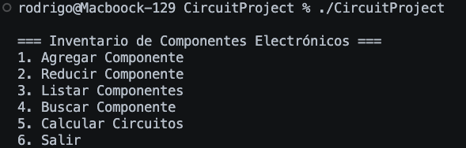

<h1 style="text-align: center;">
    Tarea #7 <br><br>
    Estructuras de Datos y Algoritmos para Ingeniería
</h1>

<h3 style="text-align: center;">
    Profesor: Esteban Badilla Alvarado <br><br>
    Estudiante: Rodrigo Sánchez Araya, C37259
</h3>


## Instrucciones de ejecución 

1. Aegúrese de estar en el apartado correspondiente a la tarea 7
```bash
cd ./ie0217/Tareas/Tarea7/CircuitProject
```

2. Dentro de esta ubicación ejecute el makefile: 
```bash
make
```

3. Ejecute los programas que desee: 

```bash
# Para ejecutar el programa base: 
./CircuitProject

# Para ejecutar el Gtest
./TestProject
```

## Parte teórica


**1. Objetivos principales del software testing** 
 a. Importancia de la verificación y validación en el software testing
La **verificación** asegura que el producto cumple con los requisitos especificados, mientras que la **validación** garantiza que el producto satisface las necesidades del usuario. Ambas son esenciales para detectar y corregir errores antes de la implementación.

b. Relación con la mejora de la calidad del software
La verificación y validación ayudan a identificar fallos tempranamente, garantizando un software funcional, seguro y confiable, mejorando así su calidad general.

c. Contribución a la experiencia del usuario y reducción de costos
El software testing asegura un producto intuitivo y sin fallos, mejorando la experiencia del usuario final. Detectar errores antes de la implementación reduce costos al evitar problemas posteriores.


 2. Concepto de "semilla" en software testing
a. Aplicaciones en software testing
- La semilla se utiliza para:
    - Generar datos de prueba reproducibles en pruebas aleatorias.
    - Crear escenarios consistentes en pruebas de rendimiento.
    - Diagnosticar errores específicos mediante la repetición de casos fallidos.

b. Uso de semillas y reproducibilidad
El uso de semillas permite repetir pruebas con los mismos datos, facilitando la identificación y resolución de errores, además de mejorar la confiabilidad.


**3. Etapas genéricas del software testing**
a. Ocho etapas del proceso de testing
- **Recolección de requisitos**: Identificar criterios de prueba.
- **Planificación de pruebas**: Diseñar estrategias y definir recursos.
- **Diseño de casos de prueba**: Crear escenarios de prueba detallados.
- **Configuración del entorno**: Preparar herramientas y sistemas.
- **Ejecución de pruebas**: Implementar los casos diseñados.
- **Registro de resultados**: Documentar hallazgos.
- **Análisis de defectos**: Identificar y clasificar errores.
- **Reporte final**: Resumir resultados y lecciones aprendidas.

b. Propósito de cada etapa
Cada etapa asegura una cobertura completa y estructurada del proceso de pruebas.

c. Pasos adicionales
Incluir revisiones entre equipos para mayor robustez y utilizar herramientas de automatización.


**4. Tipos de pruebas de software**
Tipos principales:
- **Unit Testing**: Verificar módulos individuales.
- **Integration Testing**: Comprobar la interacción entre módulos.
- **System Testing**: Validar el sistema completo.
- **Acceptance Testing**: Asegurar cumplimiento de requisitos del cliente.
- **Regression Testing**: Detectar nuevos fallos tras cambios.

Aplicaciones y ejemplos: 
Cada tipo identifica fallos específicos como errores lógicos, de integración o de diseño, adaptándose al ciclo de desarrollo.


**5. Unit Testing**
a. Contribución al desarrollo ágil y TDD
Unit testing permite detectar errores rápidamente y facilita iteraciones frecuentes.

b. Beneficios clave
- Detectar errores tempranos.
- Simplificar mantenimiento.
- Documentar código implícitamente.

c. Desafíos y mitigaciones
Tiempo inicial y cobertura limitada, mitigados con herramientas automatizadas y revisiones regulares.


 **6. GoogleTest en unit testing**
a. Tipos de revisiones
- **Assertions básicas**: Validan condiciones simples.
- **Mocking**: Simulan dependencias externas.

b. Diferencias en efectividad
Mocking es ideal para sistemas complejos, mientras que assertions básicas son rápidas para verificaciones simples.

 c. Usos específicos
- **Cálculos numéricos**: Floating-point assertions.
- **Cadenas de texto**: String comparison.


 **7. Functional Testing**
a. Definición y características
Valida que el software cumple con requisitos funcionales específicos.

b. Tipos de errores detectados
Fallas de lógica, integridad de datos y mal manejo de entradas.

c. Comparación con Unit y System Testing
Functional Testing evalúa el sistema desde la perspectiva del usuario.


 **8. Comandos en unit testing**
a. Binary Comparison
- Útil para validar archivos binarios.
b. String Comparison
- Verifica contenido y formato.
c. Exception Assertions
- Detectan condiciones excepcionales en tiempo de ejecución.
d. Predicate Assertions
- Mejora la claridad de los errores reportados.
e. Floating-Point Comparison
- Crucial para cálculos de precisión.


 **9. Cobertura de código**
a. Definición
Porcentaje de código evaluado durante las pruebas.

b. Tipos de cobertura
- **Cobertura de líneas**: Asegura ejecución de líneas de código.
- **Cobertura de ramas**: Valida decisiones lógicas.

c. Ejemplo
Identificar funciones no probadas.


 **10. Herramienta de Coverity**
a. Propósito
Identificar errores mediante análisis estático.

b. Ventajas
No requiere ejecución del programa, ideal para detectar errores tempranos.

c. Flujo de trabajo
Analiza código, genera informes y clasifica vulnerabilidades.


 **11. CI/CD**
 a. Definición
- **CI**: Automatiza integración de código.
- **CD**: Facilita entrega rápida de software.

b. Diferencias
CI se centra en integración; CD, en despliegue.

 c. Beneficios
- Menor tiempo de desarrollo.
- Entregas más rápidas.
- Reducción de errores.


 **12. Uso de GitHub en CI/CD**
a. Relación
GitHub integra herramientas para CI/CD, como Actions.

b. GitHub Actions
Automatiza flujos de trabajo.

c. Ventajas
Integración nativa y flexibilidad.

 **13. Configuración de GitHub Actions**
a. Componentes principales
- **Workflow**: Define tareas generales.
- **Job**: Agrupa pasos específicos.
- **Step**: Ejecuciones individuales.


 **14. Mocking y Stubbing**
Definición:
Técnicas para simular dependencias y probar componentes aislados.


 **15. Testing Manual vs Automatizado**
Preferencias: 
El manual es ideal para exploración; el automatizado, para repetibilidad.


 **16. Herramientas de Testing Automatizado**
Ejemplos
- Selenium: Automatización de interfaces.
- JUnit: Pruebas unitarias en Java.


## Descripción del programa

El sistema desarrollado está dividido en dos módulos principales: Inventario y Circuitos, además de un menú interactivo para facilitar la interacción con el usuario.

- Módulo de Inventario
    - Este módulo permite la gestión de componentes electrónicos. Sus principales funcionalidades incluyen:

- Agregar Componente: Permite añadir un nuevo componente al inventario o incrementar la cantidad de uno existente.
- Reducir Componente: Reduce la cantidad disponible de un componente específico.
- Buscar Componente: Encuentra y muestra la información de un componente en base a su nombre.
- Listar Componentes: Muestra una lista completa de los componentes almacenados en el inventario.
- Eliminar Componente (Implementado en el código, pero no accesible desde el menú): Elimina un componente del inventario.
- Módulo de Circuitos
    - Este módulo calcula las propiedades eléctricas de circuitos (resistencias, capacitancias e inductancias) en configuraciones serie o paralelo:

        - Resistencia Serie y Paralelo: Calcula la resistencia total según la conexión.
        - Capacitancia Serie y Paralelo: Calcula la capacitancia total.
        - Inductancia Serie y Paralelo: Calcula la inductancia total.
- Menú Interactivo
    - El menú permite a los usuarios interactuar con los módulos, seleccionando opciones que ejecutan las funcionalidades deseadas.


## instrucciones de uso: 

## Inicio del Programa

 - Al ejecutar el programa, se mostrará un menú interactivo con varias opciones disponibles:





### Opciones del menú

1. Agregar Componente
Esta opción permite agregar un nuevo componente al inventario o incrementar la cantidad de un componente existente.

Ejemplo de Interacción
```bash
Ingrese el nombre del componente: Resistencia1
Ingrese el tipo del componente: Resistencia
Ingrese la cantidad: 10
Ingrese la descripción: Resistencia de 10 ohms
```

Dentro del código: 

```cpp
void Inventario::agregarComponente(const std::string& nombre, const std::string& tipo, int cantidad, const std::string& descripcion) {
    auto it = std::find_if(componentes.begin(), componentes.end(), [&](const Componente& c) {
        return c.nombre == nombre;
    });

    if (it != componentes.end()) {
        it->cantidad += cantidad;
    } else {
        componentes.push_back(Componente(nombre, tipo, cantidad, descripcion));
    }
}
```

2. Reducir Componente
Permite disminuir la cantidad disponible de un componente en el inventario.
```bash
Ingrese el nombre del componente: Resistencia1
Ingrese la cantidad a reducir: 5
```

Dentro del codigo:
```cpp
void Inventario::reducirComponente(const std::string& nombre, int cantidad) {
    auto it = std::find_if(componentes.begin(), componentes.end(), [&](const Componente& c) {
        return c.nombre == nombre;
    });

    if (it == componentes.end() || it->cantidad < cantidad) {
        throw std::invalid_argument("No hay suficiente cantidad o el componente no existe.");
    }

    it->cantidad -= cantidad;
}
```cpp


Claro, aquí está completamente en formato Markdown:

markdown
Copiar código
# Instrucciones de Uso del Programa

## Requisitos Previos
1. Asegúrate de que el programa ha sido correctamente compilado y se encuentra listo para ejecutarse desde un terminal.
2. Prepara los valores y componentes que deseas gestionar o calcular.

## Inicio del Programa
Al ejecutar el programa, se mostrará un menú interactivo con varias opciones disponibles:

```cpp
void mostrarMenu() {
    std::cout << "\n=== Inventario de Componentes Electrónicos ===\n";
    std::cout << "1. Agregar Componente\n";
    std::cout << "2. Reducir Componente\n";
    std::cout << "3. Listar Componentes\n";
    std::cout << "4. Buscar Componente\n";
    std::cout << "5. Calcular Circuitos\n";
    std::cout << "6. Salir\n";
    std::cout << "Seleccione una opción: ";
}
```
#### Opciones del Menú
1. Agregar Componente
Esta opción permite agregar un nuevo componente al inventario o incrementar la cantidad de un componente existente.

Ejemplo de Interacción
```bash

Ingrese el nombre del componente: Resistencia1
Ingrese el tipo del componente: Resistencia
Ingrese la cantidad: 10
Ingrese la descripción: Resistencia de 10 ohms
Resultado:
```

```cpp

void Inventario::agregarComponente(const std::string& nombre, const std::string& tipo, int cantidad, const std::string& descripcion) {
    auto it = std::find_if(componentes.begin(), componentes.end(), [&](const Componente& c) {
        return c.nombre == nombre;
    });

    if (it != componentes.end()) {
        it->cantidad += cantidad;
    } else {
        componentes.push_back(Componente(nombre, tipo, cantidad, descripcion));
    }
}
```
2. Reducir Componente
Permite disminuir la cantidad disponible de un componente en el inventario.

Ejemplo de Interacción
less
```bash
Ingrese el nombre del componente: Resistencia1
Ingrese la cantidad a reducir: 5
```

```cpp
void Inventario::reducirComponente(const std::string& nombre, int cantidad) {
    auto it = std::find_if(componentes.begin(), componentes.end(), [&](const Componente& c) {
        return c.nombre == nombre;
    });

    if (it == componentes.end() || it->cantidad < cantidad) {
        throw std::invalid_argument("No hay suficiente cantidad o el componente no existe.");
    }

    it->cantidad -= cantidad;
}
```
3. Listar Componentes
Muestra todos los componentes disponibles en el inventario.

Ejemplo de Interacción: 

```bash
Componentes en inventario:
Nombre: Resistencia1, Tipo: Resistencia, Cantidad: 5, Descripción: Resistencia de 10 ohms
```
Dentro del codigo

```cpp
std::vector<Componente> Inventario::listarComponentes() const {
    return componentes;
}
```

4. Buscar Componente
Permite buscar un componente específico por su nombre en el inventario.

Ejemplo de Interacción

```bash
Ingrese el nombre del componente a buscar: Resistencia1
```

Se obtiene: 

```bash
Componente encontrado: Resistencia1, Resistencia, 5, Resistencia de 10 ohms
```


Dentro del codigo: 

```cpp
const Componente& Inventario::buscarComponente(const std::string& nombre) const {
    auto it = std::find_if(componentes.begin(), componentes.end(), [&](const Componente& c) {
        return c.nombre == nombre;
    });

    if (it == componentes.end()) {
        throw std::out_of_range("Componente no encontrado.");
    }

    return *it;
}
```


5. Calcular Circuitos
Realiza cálculos de circuitos relacionados con resistencias, capacitancias o inductancias en serie o paralelo.

Ejemplo de Interacción

```bash
Seleccione una opción: 1
Ingrese la cantidad de valores: 3
Ingrese los valores separados por espacio: 10 20 30
```
Resultado: 

```bash
Resistencia en Serie: 60 ohms
```

Dentro del codigo: 
```cpp
std::cout << "Seleccione el tipo de cálculo:\n";
std::cout << "1. Resistencias en Serie\n";
std::cout << "2. Resistencias en Paralelo\n";
// ...

std::vector<double> valores(n);
std::cout << "Ingrese los valores separados por espacio: ";
for (int i = 0; i < n; ++i) {
    std::cin >> valores[i];
}

switch (tipo) {
    case 1:
        std::cout << "Resistencia en Serie: " << Circuitos::resistenciaSerie(valores) << " ohms\n";
        break;
    case 2:
        std::cout << "Resistencia en Paralelo: " << Circuitos::resistenciaParalelo(valores) << " ohms\n";
        break;
// ...
}
```

6. Salir


# Proceso de Testing

## 1. Pruebas para el módulo `Inventario`

El módulo **Inventario** maneja componentes electrónicos y su cantidad en un sistema de inventario. Las pruebas realizadas verifican la correcta funcionalidad de agregar, reducir y buscar componentes.

### Pruebas realizadas:

- **Agregar y buscar un componente**: Se prueba que se pueda agregar un componente (como una resistencia) y luego buscarlo correctamente.
- **Reducir un componente**: Se prueba la capacidad de reducir la cantidad de un componente y verificar que se actualice correctamente.
- **Reducir componente con cantidad insuficiente**: Se prueba que el sistema arroje una excepción cuando se intenta reducir más cantidad de la disponible.
- **Agregar componente duplicado**: Verifica que al agregar un componente duplicado con diferente cantidad, esta cantidad se sume correctamente.
- **Buscar un componente inexistente**: Asegura que se lance una excepción cuando se busca un componente que no existe.
- **Agregar componente con cantidad cero**: Se prueba la agregación de un componente con cantidad cero y que esto se maneje correctamente.

### Ejemplo de prueba: 

```cpp
TEST(InventarioTest, AgregarYBuscarComponente) {
    Inventario inventario;
    inventario.agregarComponente("Resistencia", "Componente Electrónico", 10, "1k Ohms");
    const Componente& resistencia = inventario.buscarComponente("Resistencia");
    EXPECT_EQ(resistencia.nombre, "Resistencia");
    EXPECT_EQ(resistencia.cantidad, 10);
}
```

## 2. Pruebas para el módulo `Circuitos`

Este módulo incluye pruebas para operaciones con resistencias, capacitancias e inductancias en serie y paralelo.

### Pruebas realizadas:

- **Resistencia en serie y paralelo**: Se prueba que el cálculo de la resistencia total para resistencias en serie y paralelo funcione correctamente, considerando valores válidos e inválidos.
- **Capacitancia en serie y paralelo**: Similar a las resistencias, se prueban tanto valores válidos como inválidos.
- **Inductancia en serie y paralelo**: Se realizan pruebas similares a las anteriores, pero para inductancias, validando que se manejen correctamente los valores negativos y extremos.

### Ejemplo de prueba:

```cpp
TEST(CircuitosTest, ResistenciaSerieValida) {
    Circuitos circuito;
    std::vector<double> resistencias = {5.0, 10.0, 15.0};
    double resultado = circuito.resistenciaSerie(resistencias);
    EXPECT_EQ(resultado, 30.0);
}
```


## 3. Cobertura de Código

### Generación del reporte de cobertura:

1. **Compilar el código** con las opciones de cobertura activadas (por ejemplo, usando el flag `-coverage` con `g++` o `--coverage` con `gcc`).
2. **Ejecutar los tests** utilizando Google Test (`gtest`).
3. **Generar el reporte de cobertura** con herramientas como `lcov`:
   - Ejecuta el comando: `lcov --capture --directory . --output-file coverage.info`.
   - Genera un reporte visual en HTML con: `genhtml coverage.info --output-directory out`.

#### Ejemplo de archivo `Makefile` con cobertura activada:

```Makefile
CXX = g++
CXXFLAGS = -std=c++11 --coverage
LDFLAGS = -lgtest -lgtest_main -pthread

all: test

test: test.o Inventario.o Circuito.o
    $(CXX) $(CXXFLAGS) test.o Inventario.o Circuito.o -o test $(LDFLAGS)

test.o: test.cpp
    $(CXX) $(CXXFLAGS) -c test.cpp

Inventario.o: Inventario.cpp Inventario.hpp
    $(CXX) $(CXXFLAGS) -c Inventario.cpp

Circuito.o: Circuito.cpp Circuito.hpp
    $(CXX) $(CXXFLAGS) -c Circuito.cpp

clean:
    rm -f *.o test coverage.info
```

#### Generar reporte en HTML:

```bash
lcov --capture --directory . --output-file coverage.info
genhtml coverage.info --output-directory out
```

### Visualización de la cobertura de código:

El reporte generado mostrará las líneas de código ejecutadas y no ejecutadas, ayudando a identificar posibles áreas no cubiertas por las pruebas. Los archivos fuente se mostrarán con líneas marcadas como **ejecutadas** (en verde) o **no ejecutadas** (en rojo).


El proceso de testing cubre una amplia gama de casos, asegurando que las funciones en ambos módulos de **Inventario** y **Circuitos** se comporten como se espera. Las pruebas incluyen validaciones para casos normales, excepciones y valores extremos. La cobertura de código debe ser revisada para asegurar que todo el código crítico esté probado adecuadamente.


Por más que se intentó, no se logró acercar al 90%


# Implementación de CI/CD

Este documento describe la configuración de CI/CD utilizando GitHub Actions para un proyecto de C++. El objetivo es asegurar que las pruebas se ejecuten automáticamente cada vez que se realice un `push` o una solicitud de extracción (`pull request`) hacia la rama `main`.

## Configuración del flujo de trabajo

```yaml
name: CI Pipeline

on:
  push:
    branches:
      - main
  pull_request:
    branches:
      - main

jobs:
  build-and-test:
    runs-on: ubuntu-latest

    steps:
      # Paso 1: Clonar el repositorio
      - name: Checkout code
        uses: actions/checkout@v2

      # Paso 2: Clonar GoogleTest dentro del proyecto
      - name: Clone GoogleTest
        run: |
          cd Tareas/Tarea7/CircuitProject
          git clone https://github.com/google/googletest.git 

      # Paso 3: Configurar CMake
      - name: Set up CMake
        uses: lukka/get-cmake@v3.21.2

      # Paso 4: Instalar dependencias necesarias
      - name: Install dependencies
        run: sudo apt-get update && sudo apt-get install -y build-essential

      # Paso 5: Clonar y compilar GoogleTest
      - name: Clone and build GoogleTest
        run: |
          git clone https://github.com/google/googletest.git
          mkdir -p googletest/build
          cd googletest/build
          cmake ..
          make
          sudo cp lib/*.a /usr/local/lib  # Copia las bibliotecas de GoogleTest

      # Paso 6: Crear directorio de compilación y compilar el proyecto
      - name: Build project
        run: |
          cd Tareas/Tarea7/CircuitProject
          mkdir -p build
          cd build
          cmake ..
          make

      # Paso 7: Ejecutar las pruebas
      - name: Run tests
        run: |
          cd Tareas/Tarea7/CircuitProject/build/tests
          ./run_tests
```

## Descripción de la configuración:

### Disparadores de CI/CD:
- El flujo de trabajo se activa cada vez que se realice un `push` o `pull_request` hacia la rama `main`.

### Job de construcción y prueba:
- Se ejecuta en un entorno `ubuntu-latest`, que es el sistema operativo base donde se instalarán todas las herramientas necesarias.

### Pasos del flujo de trabajo:
1. **Checkout del código**: Utiliza `actions/checkout@v2` para clonar el repositorio.
2. **Instalación de GoogleTest**: Clona GoogleTest desde su repositorio oficial en GitHub, y lo compila para que las bibliotecas necesarias estén disponibles.
3. **Configuración de CMake**: Utiliza el `get-cmake` para instalar la herramienta CMake que permite gestionar el proceso de construcción del proyecto.
4. **Instalación de dependencias**: Instala las dependencias necesarias, en este caso, los paquetes esenciales para la construcción del proyecto.
5. **Compilación del proyecto**: Crea un directorio de compilación, ejecuta `cmake` para generar los archivos necesarios, y luego utiliza `make` para compilar el proyecto.
6. **Ejecución de las pruebas**: Finalmente, ejecuta las pruebas almacenadas en el directorio `tests`, utilizando el ejecutable de pruebas generado por el proceso de compilación.

## Integración en el flujo de trabajo del proyecto:
### Automatización de pruebas:
Este flujo de trabajo asegura que, al realizar cualquier cambio en el código, las pruebas se ejecuten automáticamente sin necesidad de intervención manual, lo que mejora la calidad del software y facilita la integración continua.

### Consistencia:
Gracias a la automatización, se garantiza que todos los desarrolladores trabajen con el mismo entorno y herramientas para la construcción y las pruebas, eliminando posibles inconsistencias.

### Detección temprana de errores:
Las pruebas se ejecutan en cada `push` y `pull_request`, lo que permite detectar errores de manera temprana y evitar que se integren cambios defectuosos en la rama principal.

Este flujo de trabajo facilita la integración continua (CI) y la entrega continua (CD) en el proyecto, asegurando que el código esté siempre en un estado funcional y listo para producción.


### Prueba de correcta ejecución del CI-CD: 


